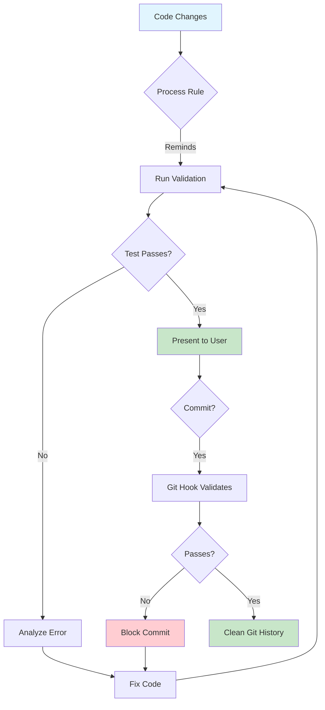
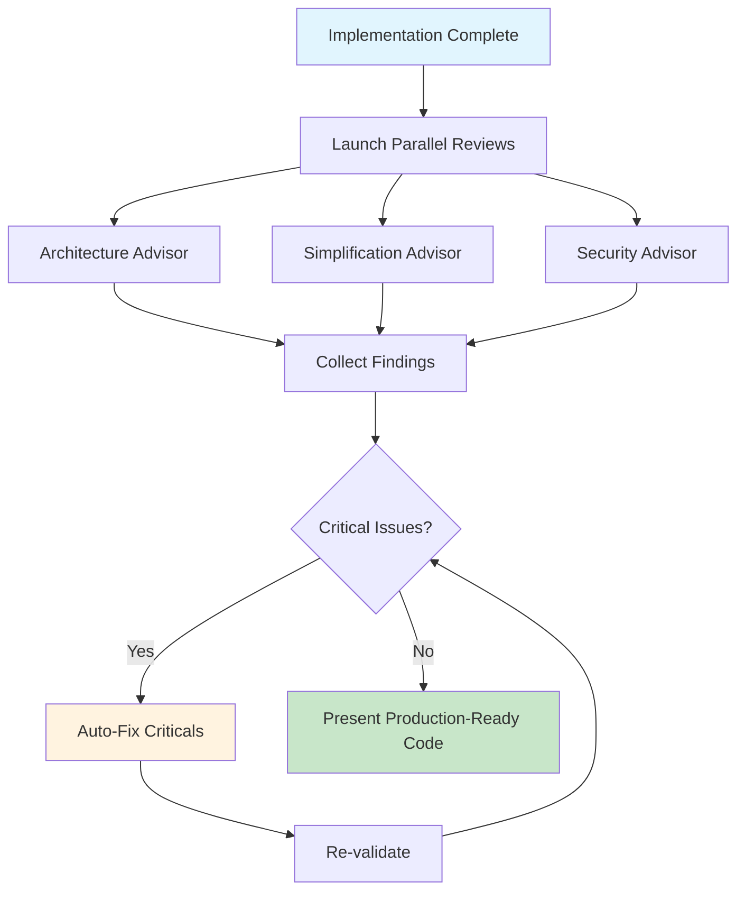
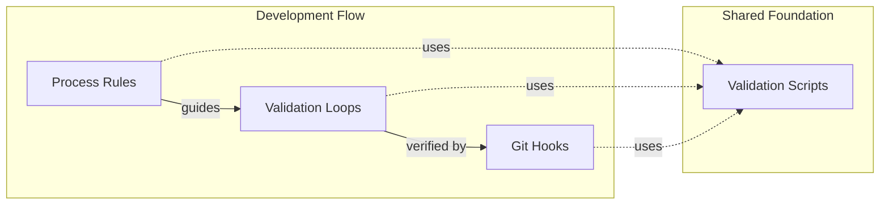

# AQE Pattern Improvement Plan

**Purpose**: Cold-startable execution plan for improving the Autonomous Quality Enforcement pattern before submitting to `jeremyeder/reference` repository.

**Source**: PR #18 review + user feedback questionnaire (2026-01-04)

**Branch**: `feature/autonomous-quality-enforcement`

**Target Files**:

- `docs/patterns/autonomous-quality-enforcement.md`
- `docs/patterns/multi-agent-code-review.md`
- `scripts/autonomous-review/review.sh`
- `scripts/validation/*.sh`

---

## Executive Summary

| ID | Task | Priority | Effort | Status |
|----|------|----------|--------|--------|
| 4 | Tone down "Three Layers" framing | P0 | 15 min | ⬜ |
| 5 | Add metrics and success criteria | P0 | 30 min | ⬜ |
| 3 | Add Mermaid diagrams | P0 | 45 min | ⬜ |
| 6 | Add quick start guide | P1 | 30 min | ⬜ |
| 8 | Add failure mode documentation | P1 | 20 min | ⬜ |
| 7 | Add CI/CD integration examples | P2 | 30 min | ⬜ |
| 1 | Fix CLI syntax in review.sh | P2 | 20 min | ⬜ |
| 2 | Add script tests | P3 | 45 min | ⬜ |

**Total estimated effort**: ~4 hours

---

## Plan [4]: Tone Down "Three Layers" Framing

**Problem**: Feedback says "Three Layers of Enforcement" sounds grandiose and questioned if it's worth highlighting.

**Goal**: Make the pattern feel practical, not academic.

### Steps

1. **Rename the section** in `autonomous-quality-enforcement.md`:
   - FROM: `## The Pattern: Three Layers of Enforcement`
   - TO: `## How It Works`

2. **Remove numbered layer references** throughout:
   - FROM: "Layer 1: Process Rules", "Layer 2: Autonomous Validation", "Layer 3: Git Hooks"
   - TO: "Process Rules", "Validation Loops", "Git Hooks"

3. **Simplify the ASCII diagram** (before converting to Mermaid):
   - Remove the box styling
   - Focus on the flow, not the layer numbers

4. **Update any cross-references** that mention "three layers"

### Acceptance Criteria

- [ ] No "Layer 1/2/3" language in docs
- [ ] Section titled "How It Works" not "Three Layers"
- [ ] Pattern still clearly explained without the layered framing

### Files to Modify

- `docs/patterns/autonomous-quality-enforcement.md`

---

## Plan [5]: Add Metrics and Success Criteria

**Problem**: Biggest issue identified - no way to measure if the pattern is working.

**Goal**: Add concrete, measurable outcomes so users know the pattern is providing value.

### Steps

1. **Add "Measuring Success" section** to `autonomous-quality-enforcement.md` after "Benefits":

```markdown
## Measuring Success

### Key Metrics

| Metric | Before AQE | Target | How to Measure |
|--------|------------|--------|----------------|
| Broken code presentations | 2-5 per feature | 0 | Count user-reported crashes |
| "Try this fix" iterations | 3-5 per bug | 0-1 | Count back-and-forth cycles |
| Time to working code | Variable | First presentation | Track presentation-to-approval time |
| Commits blocked by hooks | N/A | >0 | Git hook rejection count |

### Success Indicators

**Week 1**: Validation scripts running on every change
**Week 2**: First autonomous fix loop catches a real bug
**Month 1**: Zero broken code presentations to users
**Month 3**: Team adopts pattern for all projects

### Anti-Metrics (What NOT to Optimize)

- Validation speed at cost of coverage
- Skipping hooks to "move faster"
- Reducing max iterations to avoid fixing hard bugs
```

2. **Add similar section to `multi-agent-code-review.md`**:

```markdown
## Measuring Success

### Key Metrics

| Metric | Before | Target | How to Measure |
|--------|--------|--------|----------------|
| Critical issues in presented code | 2-3 | 0 | Agent review findings |
| Rework cycles per feature | 3-5 | 1 | Iteration count |
| Time spent on code review | Hours | Minutes | Review duration |

### Success Indicators

- User never sees code with critical issues
- First code presentation is production-ready
- Reviews complete in <10 minutes (parallel agents)
```

### Acceptance Criteria

- [ ] Both docs have "Measuring Success" section
- [ ] Metrics are concrete and measurable
- [ ] Includes timeline-based success indicators
- [ ] Includes anti-metrics to prevent gaming

### Files to Modify

- `docs/patterns/autonomous-quality-enforcement.md`
- `docs/patterns/multi-agent-code-review.md`

---

## Plan [3]: Add Mermaid Diagrams

**Problem**: ASCII art diagrams don't render well and look dated.

**Goal**: Replace with Mermaid diagrams that render in GitHub and MkDocs.

### Steps

1. **Replace AQE workflow diagram** in `autonomous-quality-enforcement.md`:



2. **Replace multi-agent review diagram** in `multi-agent-code-review.md`:



3. **Add component diagram** showing the three parts:



### Acceptance Criteria

- [ ] All ASCII diagrams replaced with Mermaid
- [ ] Diagrams render correctly in GitHub preview
- [ ] Diagrams are simple and readable
- [ ] Color coding is consistent (green=success, red=failure, blue=start)

### Files to Modify

- `docs/patterns/autonomous-quality-enforcement.md`
- `docs/patterns/multi-agent-code-review.md`

---

## Plan [6]: Add Quick Start Guide

**Problem**: Adoption barrier - learning curve too steep. Users need a 5-minute path to value.

**Goal**: Add copy-paste quick start that gets users to a working validation loop immediately.

### Steps

1. **Add "Quick Start" section** at the TOP of `autonomous-quality-enforcement.md` (after overview):

```markdown
## Quick Start (5 Minutes)

Get a working validation loop in your project:

### Step 1: Create Validation Script (1 min)

```bash
mkdir -p scripts/validation
cat > scripts/validation/check.sh << 'EOF'
#!/bin/bash
set -e
echo "🔍 Running validation..."

# Add your checks here:
npm run lint 2>&1 || exit 1
npm run test 2>&1 || exit 1

echo "✅ All checks passed"
EOF
chmod +x scripts/validation/check.sh
```

### Step 2: Create Autonomous Loop (1 min)

```bash
cat > scripts/validation/auto-fix.sh << 'EOF'
#!/bin/bash
set -e
MAX=3
for i in $(seq 1 $MAX); do
  echo "🤖 Attempt $i/$MAX"
  if ./scripts/validation/check.sh; then
    echo "✅ Validation passed"
    exit 0
  fi
  echo "❌ Failed - fix and re-run"
  exit 1
done
EOF
chmod +x scripts/validation/auto-fix.sh
```

### Step 3: Add Git Hook (1 min)

```bash
cat > .git/hooks/pre-commit << 'EOF'
#!/bin/bash
./scripts/validation/check.sh
EOF
chmod +x .git/hooks/pre-commit
```

### Step 4: Test It (2 min)

```bash
# Run validation manually
./scripts/validation/auto-fix.sh

# Try to commit - hook will validate
git add . && git commit -m "test"
```

**Done!** You now have autonomous validation with a git hook safety net.

### Next Steps

- Customize `check.sh` for your project's linting/testing
- Add process rule reminders (see Process Rules section)
- Add more validation types (security, types, etc.)

```

### Acceptance Criteria

- [ ] Quick start is at top of doc (high visibility)
- [ ] All commands are copy-paste ready
- [ ] Total time is under 5 minutes
- [ ] Works for any project type (generic commands)
- [ ] Includes "next steps" for deeper adoption

### Files to Modify

- `docs/patterns/autonomous-quality-enforcement.md`

---

## Plan [8]: Add Failure Mode Documentation

**Problem**: What happens when autonomous fix loops get stuck? No guidance provided.

**Goal**: Document failure modes, escape hatches, and debugging strategies.

### Steps

1. **Add "When Things Go Wrong" section** to `autonomous-quality-enforcement.md`:

```markdown
## When Things Go Wrong

### Failure Mode 1: Infinite Loop

**Symptom**: Validation keeps failing, AI keeps "fixing" but never succeeds.

**Causes**:
- Test is flaky (passes/fails randomly)
- Fix creates new bug that causes different failure
- Underlying issue requires human judgment

**Solution**:
```bash
# Set max iterations in your loop script
MAX_ITERATIONS=3  # Stop after 3 attempts

# Add circuit breaker
if [ $iteration -ge $MAX_ITERATIONS ]; then
    echo "❌ Max iterations reached"
    echo "Manual intervention required"
    echo "Last error: $LAST_ERROR"
    exit 1
fi
```

### Failure Mode 2: Silent Failures

**Symptom**: Validation passes but code is still broken.

**Causes**:

- Validation script doesn't cover the failure case
- Exit codes not properly propagated
- Test mocking hides real issues

**Solution**:

- Always use `set -e` in bash scripts
- Add smoke tests that exercise real behavior
- Review validation coverage periodically

### Failure Mode 3: Git Hook Bypass

**Symptom**: Broken code ends up in git despite hooks.

**Causes**:

- User ran `git commit --no-verify`
- Hook file not executable
- Hook path misconfigured

**Solution**:

```bash
# Verify hook is active
ls -la .git/hooks/pre-commit  # Should be executable

# Check hook path
git config core.hooksPath  # Should be empty or .git/hooks

# Add CI as final safety net (see CI/CD section)
```

### Failure Mode 4: Validation Too Slow

**Symptom**: Feedback loop takes >60 seconds, breaking flow.

**Causes**:

- Running full test suite instead of affected tests
- No caching/incremental builds
- Unnecessary validations

**Solution**:

- Use affected-file detection: only validate changed code
- Cache dependencies between runs
- Split into fast (lint) and slow (e2e) validation tiers

```

### Acceptance Criteria

- [ ] Documents at least 4 common failure modes
- [ ] Each has symptom, cause, and solution
- [ ] Includes code examples for fixes
- [ ] Covers both technical and process failures

### Files to Modify

- `docs/patterns/autonomous-quality-enforcement.md`

---

## Plan [7]: Add CI/CD Integration Examples

**Problem**: Unclear how pattern integrates with existing CI/CD pipelines.

**Goal**: Provide GitHub Actions examples showing the same scripts in CI.

### Steps

1. **Add "CI/CD Integration" section** to `autonomous-quality-enforcement.md`:

```markdown
## CI/CD Integration

The same validation scripts used locally should run in CI. One source of truth.

### GitHub Actions Example

```yaml
# .github/workflows/validate.yml
name: Validate

on:
  push:
    branches: [main]
  pull_request:
    branches: [main]

jobs:
  validate:
    runs-on: ubuntu-latest
    steps:
      - uses: actions/checkout@v4
      
      - name: Setup
        run: npm ci
      
      - name: Run Validation
        run: ./scripts/validation/check.sh
```

### PR Validation with Status Checks

```yaml
# .github/workflows/pr-validate.yml
name: PR Validation

on:
  pull_request:
    types: [opened, synchronize]

jobs:
  validate:
    runs-on: ubuntu-latest
    steps:
      - uses: actions/checkout@v4
      
      - name: Run All Validations
        run: |
          ./scripts/validation/check.sh
          # Add more validation scripts as needed
      
      - name: Comment on Failure
        if: failure()
        uses: actions/github-script@v7
        with:
          script: |
            github.rest.issues.createComment({
              issue_number: context.issue.number,
              owner: context.repo.owner,
              repo: context.repo.repo,
              body: '❌ Validation failed. Run `./scripts/validation/check.sh` locally to debug.'
            })
```

### Branch Protection

Require validation to pass before merge:

1. Go to Settings → Branches → Branch protection rules
2. Enable "Require status checks to pass"
3. Select your validation workflow

### Key Principle

**Same scripts everywhere**:

- Local development: `./scripts/validation/check.sh`
- Git hooks: `./scripts/validation/check.sh`
- CI/CD: `./scripts/validation/check.sh`

No divergence. If CI fails, local will fail too.

```

### Acceptance Criteria

- [ ] GitHub Actions workflow examples included
- [ ] Shows PR validation with comments
- [ ] Explains branch protection setup
- [ ] Emphasizes "same scripts everywhere" principle

### Files to Modify

- `docs/patterns/autonomous-quality-enforcement.md`

---

## Plan [1]: Fix CLI Syntax in review.sh

**Problem**: Script uses `claude task --agent` which doesn't exist in Claude Code.

**Goal**: Either make the script runnable or clearly mark as reference/pseudocode.

### Option A: Mark as Reference Implementation (Recommended)

1. **Rename the file**:
   - FROM: `scripts/autonomous-review/review.sh`
   - TO: `scripts/autonomous-review/review-reference.sh`

2. **Update header comment**:

```bash
#!/bin/bash
# REFERENCE IMPLEMENTATION - Multi-Agent Code Review Orchestrator
#
# This script demonstrates the PATTERN for orchestrating parallel agent reviews.
# The actual CLI syntax (`claude task --agent`) is conceptual.
#
# To implement this pattern with real tooling:
# - Claude Code: Use Task tool with subagent_type parameter in your prompts
# - OpenAI: Adapt to Assistants API with multiple assistants
# - Custom: Implement agent dispatch using your preferred framework
#
# The workflow (parallel launch → collect findings → auto-fix criticals) is the
# key value - adapt the specific invocations to your tooling.
```

3. **Add pseudocode markers** around non-runnable sections:

```bash
# === PSEUDOCODE: Agent invocation ===
# In practice, replace with your actual agent invocation:
#   - Claude Code Task tool
#   - API call to AI service
#   - Custom agent framework
claude task --agent "$agent" --prompt "$PROMPT" > "$OUTPUT_DIR/$agent.md" 2>&1 &
# === END PSEUDOCODE ===
```

### Option B: Make Actually Runnable (More Effort)

Convert to a script that:

1. Calls Claude Code CLI if available
2. Falls back to mock mode for demonstration
3. Uses real subprocess management

This is more work and may not be worth it for a reference repo.

### Acceptance Criteria

- [ ] File clearly marked as reference/conceptual
- [ ] Users understand they need to adapt for their tooling
- [ ] Pattern is still clearly demonstrated
- [ ] No one tries to run it and gets confused

### Files to Modify

- `scripts/autonomous-review/review.sh` (rename + update)
- `docs/patterns/multi-agent-code-review.md` (update references)

---

## Plan [2]: Add Script Tests

**Problem**: Validation scripts should be tested before being adopted.

**Goal**: Add basic tests that verify scripts work correctly.

### Steps

1. **Create test directory**:

```bash
mkdir -p scripts/validation/tests
```

2. **Create test for autonomous-fix-loop-template.sh**:

```bash
# scripts/validation/tests/test-autonomous-fix-loop.sh
#!/bin/bash
set -e

SCRIPT_DIR="$(cd "$(dirname "${BASH_SOURCE[0]}")/.." && pwd)"
TEST_DIR=$(mktemp -d)
trap "rm -rf $TEST_DIR" EXIT

echo "Testing autonomous-fix-loop-template.sh"

# Test 1: Passing validation
echo "Test 1: Passing validation should exit 0"
cat > "$TEST_DIR/pass.sh" << 'EOF'
#!/bin/bash
echo "Validation passed"
exit 0
EOF
chmod +x "$TEST_DIR/pass.sh"

if "$SCRIPT_DIR/autonomous-fix-loop-template.sh" "$TEST_DIR/pass.sh" 2>/dev/null; then
    echo "✅ Test 1 passed"
else
    echo "❌ Test 1 failed"
    exit 1
fi

# Test 2: Failing validation
echo "Test 2: Failing validation should exit 1"
cat > "$TEST_DIR/fail.sh" << 'EOF'
#!/bin/bash
echo "Validation failed"
exit 1
EOF
chmod +x "$TEST_DIR/fail.sh"

if ! "$SCRIPT_DIR/autonomous-fix-loop-template.sh" "$TEST_DIR/fail.sh" 2>/dev/null; then
    echo "✅ Test 2 passed"
else
    echo "❌ Test 2 failed"
    exit 1
fi

# Test 3: Missing script
echo "Test 3: Missing script should exit 1"
if ! "$SCRIPT_DIR/autonomous-fix-loop-template.sh" "/nonexistent.sh" 2>/dev/null; then
    echo "✅ Test 3 passed"
else
    echo "❌ Test 3 failed"
    exit 1
fi

echo ""
echo "✅ All tests passed"
```

3. **Create test runner**:

```bash
# scripts/validation/tests/run-all.sh
#!/bin/bash
set -e

SCRIPT_DIR="$(cd "$(dirname "${BASH_SOURCE[0]}")" && pwd)"

echo "Running all validation script tests"
echo "=================================="

for test in "$SCRIPT_DIR"/test-*.sh; do
    echo ""
    echo "Running: $(basename "$test")"
    echo "----------------------------------"
    bash "$test"
done

echo ""
echo "=================================="
echo "✅ All test suites passed"
```

4. **Add to CI** (optional):

```yaml
# In .github/workflows/validate.yml
- name: Test validation scripts
  run: ./scripts/validation/tests/run-all.sh
```

### Acceptance Criteria

- [ ] Tests exist for autonomous-fix-loop-template.sh
- [ ] Tests cover: passing, failing, missing script cases
- [ ] Test runner script executes all tests
- [ ] Tests pass locally

### Files to Create

- `scripts/validation/tests/test-autonomous-fix-loop.sh`
- `scripts/validation/tests/run-all.sh`

---

## Execution Order

### Phase 1: Critical Fixes (P0)

```bash
# 1. Tone down framing [4]
# 2. Add metrics [5]
# 3. Add Mermaid diagrams [3]
```

### Phase 2: Adoption Enablers (P1)

```bash
# 4. Add quick start [6]
# 5. Add failure modes [8]
```

### Phase 3: Polish (P2-P3)

```bash
# 6. Add CI/CD examples [7]
# 7. Fix CLI syntax [1]
# 8. Add script tests [2]
```

---

## Verification Checklist

Before creating PR to reference repo:

- [ ] All P0 items completed
- [ ] All P1 items completed
- [ ] `markdownlint docs/patterns/*.md` passes
- [ ] Mermaid diagrams render in GitHub preview
- [ ] Quick start commands actually work
- [ ] No "Three Layers" grandiose language remains
- [ ] Metrics section has concrete numbers
- [ ] Failure modes are documented

---

## How to Use This Plan

1. **Cold start**: Read this file, pick up where status shows ⬜
2. **Execute**: Follow steps in each plan section
3. **Mark complete**: Update status to ✅ when done
4. **Commit**: After each plan, commit with message referencing plan ID
5. **Verify**: Run checklist before final PR

Example commit messages:

- `docs: tone down three layers framing [plan-4]`
- `docs: add metrics and success criteria [plan-5]`
- `docs: replace ASCII art with Mermaid diagrams [plan-3]`
