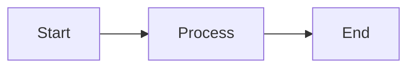

# API Reference: How to Use the Template Tools

This page explains all the scripts, workflows, and tools included in the template and how to use them.

**Note**: This template doesn't include a working application - these are tools for managing documentation and automation.

## Scripts You Can Run

### setup.sh - Initial Setup

Sets up your environment when you first start using the template.

**How to Run**:
```bash
./scripts/setup.sh
```

**What It Does**:
1. Checks if you have Git and Node.js
2. Verifies all folders exist
3. Asks if you want to install helpful tools
4. Runs quick tests
5. Reports how long it took (goal: under 10 minutes)

**When It Finishes Successfully**:
- You'll see green checkmarks (✓)
- Exit code will be 0
- You're ready to start working

**If Something Goes Wrong**:
- You'll see red X marks (✗)
- Exit code will be 1
- Read the error message for what to fix

**What Just Happened?**
Exit codes are numbers programs return when they finish. 0 means success, 1 means error. Other programs can check this to know if the script worked.

### validate-mermaid.sh - Check Diagrams

Checks if your Mermaid diagrams have syntax errors.

**How to Run**:
```bash
./scripts/validate-mermaid.sh
```

**What You Need First**:
- mermaid-cli installed: `npm install -g @mermaid-js/mermaid-cli`

**What It Does**:
- Finds all `.mmd` files in `docs/diagrams/`
- Tests each one to see if it's valid
- Reports which ones have errors

**Output You'll See**:
```
Found 3 diagram(s) to validate...

Checking architecture.mmd... ✓
Checking workflow.mmd... ✓
Checking pipeline.mmd... ✗ FAILED
  Syntax error in docs/diagrams/pipeline.mmd
```

**What Just Happened?**
The script tried to convert each diagram to an image. If the conversion fails, there's a syntax error in your diagram that needs fixing.

### check-doc-pairs.sh - Verify Documentation Pairs

Makes sure every standard documentation file has a Terry version.

**How to Run**:
```bash
./scripts/check-doc-pairs.sh
```

**What It Does**:
- Looks for all `.md` files in `docs/`
- For each one, checks if a `-terry.md` version exists
- Reports any missing pairs

**Example Output**:
```
Checking documentation pairs...

Checking quickstart.md... ✓ (has Terry version)
Checking tutorial.md... ✗ MISSING
  Expected: docs/tutorial-terry.md

✗ 1 documentation file(s) missing Terry versions
```

**How to Fix Missing Pairs**:
Create the missing `-terry.md` file with an accessible version of the content.

**What Just Happened?**
This enforces the "dual documentation" rule - every topic must exist in both standard (technical) and Terry (accessible) formats.

### record-demo.sh - Record Tutorials

Records your terminal session as a tutorial video.

**How to Run**:
```bash
./scripts/record-demo.sh <tutorial-name>
```

**Available Tutorials**:
- `setup` - Show the complete setup process
- `first-feature` - Demonstrate building a feature
- `agent-workflow` - Show how the AI agent works

**Example**:
```bash
./scripts/record-demo.sh setup
# Follow the instructions on screen
# Press Ctrl+D when done
# Recording saved to docs/tutorials/setup.cast
```

**What You Need First**:
- asciinema installed (see [asciinema.org](https://asciinema.org/))

**What Just Happened?**
Asciinema recorded everything you typed and displayed in your terminal. The `.cast` file can be played back to show others how to use the template.

## Automated Workflows (CI/CD)

These run automatically on GitHub when you push code.

### validate-docs.yml - Documentation Checks

**When It Runs**:
- Every time you push to main
- Every time you create a pull request

**What It Checks**:
1. Markdown files are formatted correctly (markdownlint)
2. All diagrams have valid syntax (validate-mermaid.sh)
3. All documentation has Terry pairs (check-doc-pairs.sh)
4. All bash scripts pass quality checks (shellcheck)

**If It Fails**:
- Your pull request can't be merged
- Check the error messages to see what to fix

**What Just Happened?**
GitHub automatically runs these checks to catch errors before code is merged. This is called "Continuous Integration" (CI) - automatically testing every change.

### security-checks.yml - Security Scans

**When It Runs**:
- When you push code
- When you create a pull request
- Every Monday at midnight (weekly scan)
- When you manually trigger it

**What It Checks**:
- No API keys or passwords in your code
- No application code directories (template is infrastructure-only)
- No Red Hat branding
- No "Amber" terminology (should use "Codebase Agent")
- All scripts are executable

**Example Errors**:
```
❌ AWS access key pattern detected!
Never commit secrets. Use environment variables.
```

**How to Fix**:
- Remove the secret from your code
- Use environment variables instead
- Check `.gitignore` is blocking sensitive files

**What Just Happened?**
The workflow scanned your code for common security problems. Catching these early prevents accidentally sharing secrets or sensitive information.

### rebuild-demos.yml - Tutorial Auto-Update

**When It Runs**:
- When you change files in `docs/`, `scripts/`, or `.claude/`
- When you manually trigger it

**What It Does**:
1. Installs asciinema
2. Re-records all tutorials automatically
3. Saves the updated recordings
4. Commits them to your repository

**Why This Exists**:
Keeps tutorial videos in sync with code changes. When you update the setup script, the setup tutorial automatically updates too.

**What Just Happened?**
GitHub Actions (GitHub's automation service) ran the script on their servers and saved the results back to your repository.

## AI Agent Configuration

### .claude/agents/codebase-agent.md

Defines the AI agent's personality and what it can do.

**What's In It**:
- Agent's name and role
- What tasks it can help with (issue-to-PR, code reviews)
- How it should behave (careful, high-quality)
- How much autonomy it has (when to ask permission)

**How It's Used**:
When you work in this repository with Claude Code, it reads this file to understand how to help you.

### .claude/context/*.md Files

These are "knowledge modules" that teach the agent about your project.

**Available Modules**:
- `architecture.md` - How the template is organized
- `security-standards.md` - How to write secure code
- `testing-patterns.md` - How to write tests

**Special Feature - Independence**:
Each module works on its own - you can copy just one to a different project and it still makes sense.

**What Just Happened?**
Instead of one huge file explaining everything, we split knowledge into separate modules. This makes it easier to maintain and lets you pick just what you need (buffet approach).

### .claude/commands/*.md Files

Custom commands you can use with the AI agent.

**Example - quickstart.md**:
When you type `/quickstart`, the agent responds with setup instructions.

**What's In A Command File**:
```markdown
# /quickstart command

Provide rapid setup instructions for new developers.

## Response Template

1. Clone repository
2. Run ./scripts/setup.sh
3. Verify installation
4. Next steps
```

**What Just Happened?**
Commands are shortcuts that trigger specific responses from the agent. Instead of asking "how do I set up?" you just type `/quickstart`.

## The Comparison Page

### docs/comparison/index.html

A webpage that shows standard and Terry documentation side-by-side.

**How to Open It**:
```bash
# macOS:
open docs/comparison/index.html

# Linux:
xdg-open docs/comparison/index.html

# Windows:
start docs/comparison/index.html
```

**What It Uses**:
- marked.js - Converts markdown to HTML
- highlight.js - Colors code examples

**How It Works**:
1. Click a topic tab (like "Quickstart")
2. JavaScript loads `quickstart.md` and `quickstart-terry.md`
3. Markdown is converted to HTML
4. Both versions display side-by-side

**What Just Happened?**
The page loads markdown files from your computer and renders them in your browser. Everything happens client-side (in your browser) - no server needed.

## File Naming Patterns

### Documentation Files

**Standard Version**: `docs/{topic}.md`
- Example: `docs/quickstart.md`
- Written for developers

**Terry Version**: `docs/{topic}-terry.md`
- Example: `docs/quickstart-terry.md`
- Written for everyone

**How to Check**: `./scripts/check-doc-pairs.sh`

### Diagram Files

**Location**: `docs/diagrams/{name}.mmd`
- Example: `docs/diagrams/architecture.mmd`

**How to Validate**: `./scripts/validate-mermaid.sh`

**How to Create**:


### Tutorial Files

**Location**: `docs/tutorials/{name}.cast`
- Example: `docs/tutorials/setup.cast`

**How to Record**: `./scripts/record-demo.sh setup`

**How to Play**: `asciinema play docs/tutorials/setup.cast`

## Configuration Files

### .markdownlint.json

Controls how strict markdown checking is.

**What It Says**:
```json
{
  "MD013": false,  // Don't complain about long lines
  "MD033": {
    "allowed_elements": ["details", "summary", "br"]  // Allow some HTML
  },
  "MD041": false  // Don't require h1 as first line
}
```

**What Just Happened?**
Markdown linting has many rules. This file turns off rules that are too strict for our documentation style.

### .github/dependabot.yml

Tells GitHub to automatically update dependencies.

**What It Does**:
- Checks for updates every Monday
- Creates pull requests for new versions
- Groups related updates together

**Why This Matters**:
Keeps your tools up to date automatically without you having to check manually.

## Understanding Exit Codes

When scripts finish, they return a number:

**0 = Success** - Everything worked!
**1 = Error** - Something went wrong

**Why This Matters**:
Other programs (like CI/CD) check exit codes to know if a script succeeded. If setup.sh returns 1, the workflow knows setup failed.

**Example**:
```bash
./scripts/validate-mermaid.sh
echo $?  # Prints the exit code (0 or 1)
```

## Troubleshooting

**"Command not found" errors**:
- Script isn't executable: `chmod +x scripts/*.sh`
- Tool not installed: Check the "What You Need First" section

**"No such file or directory"**:
- Wrong folder: Run `pwd` to see where you are
- File doesn't exist yet: Check if you created it
- Typo in filename: Check spelling exactly

**"Permission denied"**:
- Script needs execute permission: `chmod +x scripts/{script}.sh`
- Git credentials issue: Run `gh auth login`

## Learn More

- [Bash Scripting Guide](https://www.gnu.org/software/bash/manual/) - Learn shell scripting
- [GitHub Actions Docs](https://docs.github.com/en/actions) - Learn CI/CD
- [Asciinema Docs](https://asciinema.org/) - Learn terminal recording
- [Mermaid Docs](https://mermaid.js.org/) - Learn diagram syntax

---

**Next**: Check out the [Development](development-terry.md) guide to learn the daily workflow for working with this template.
