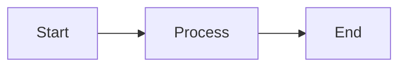

# API Reference

Pattern documentation and examples for template usage.

**Note**: This template contains no application code. Patterns shown are examples for documentation purposes.

## Script API

### setup.sh

Environment setup and validation script.

**Usage**:
```bash
./scripts/setup.sh
```

**Exit Codes**:
- `0` - Success
- `1` - Error (missing dependencies, validation failure)

**Environment Variables**:
None required.

**Output**:
- Colored status messages
- Progress indicators (1/6, 2/6, etc.)
- Timing report (<10 min goal)

### validate-mermaid.sh

Diagram syntax validation.

**Usage**:
```bash
./scripts/validate-mermaid.sh
```

**Requirements**:
- mermaid-cli (`mmdc`) installed

**Exit Codes**:
- `0` - All diagrams valid
- `1` - Validation errors found

**Output**:
- Per-file validation status
- Error details for failed diagrams

### check-doc-pairs.sh

Documentation pair verification.

**Usage**:
```bash
./scripts/check-doc-pairs.sh
```

**Exit Codes**:
- `0` - All pairs exist
- `1` - Missing Terry versions

**Output**:
- Per-file pair status
- List of missing Terry versions

### record-demo.sh

Asciinema tutorial recording.

**Usage**:
```bash
./scripts/record-demo.sh <tutorial-name>
```

**Arguments**:
- `tutorial-name` - One of: setup, first-feature, agent-workflow

**Requirements**:
- asciinema installed

**Output**:
- Recording saved to `docs/tutorials/<name>.cast`

**Example**:
```bash
./scripts/record-demo.sh setup
# Follow on-screen instructions
# Recording saved to docs/tutorials/setup.cast
```

## CI/CD Workflows

### validate-docs.yml

Documentation and diagram validation workflow.

**Triggers**:
- Push to main
- Pull requests to main

**Jobs**:
1. Checkout code
2. Install Node.js dependencies
3. Run markdownlint
4. Run validate-mermaid.sh
5. Run check-doc-pairs.sh
6. Run shellcheck on scripts

**Configuration**:
- Node.js 18.x
- Ubuntu latest runner

### security-checks.yml

Security scanning workflow.

**Triggers**:
- Push to main/feature branches
- Pull requests to main
- Weekly schedule (Mondays 00:00 UTC)
- Manual dispatch

**Checks**:
- AWS access key patterns (AKIA)
- GitHub token patterns (ghp_)
- Generic secret patterns
- Application code directories
- Red Hat branding
- Amber terminology
- Script permissions

**Exit Codes**:
- `0` - No security issues
- `1` - Security violations found

### rebuild-demos.yml

Asciinema tutorial auto-rebuild.

**Triggers**:
- Push to main (paths: docs/, scripts/, .claude/)
- Manual dispatch

**Jobs**:
1. Install asciinema
2. Run record-demo.sh for each tutorial
3. Commit updated .cast files
4. Push changes

**Dependency**:
- Runs before validate-docs.yml

## Agent Configuration

### .claude/agents/codebase-agent.md

Agent personality and capabilities definition.

**Sections**:
- Agent name and role
- Capabilities (issue-to-PR, code review)
- Operating principles
- Autonomy levels

**Usage**:
Referenced by Claude Code when working in repository.

### .claude/context/*.md

Modular knowledge modules.

**Available Modules**:
- `architecture.md` - Layered architecture patterns
- `security-standards.md` - OWASP top 10, input validation
- `testing-patterns.md` - Arrange-Act-Assert, mocking, coverage

**Pattern**:
- Technology-agnostic
- Standalone (no hard dependencies)
- Pattern-focused (not framework-specific)

**Usage**:
Referenced by Codebase Agent for context-aware assistance.

### .claude/commands/*.md

Slash command definitions.

**Example - quickstart.md**:
```markdown
# /quickstart command

Provide rapid setup instructions for new developers.

## Response Template

1. Clone repository
2. Run ./scripts/setup.sh
3. Verify installation
4. Next steps
```

**Usage**:
Type `/quickstart` in Claude Code to trigger command.

## Comparison Page API

### docs/comparison/index.html

Client-side documentation viewer.

**Dependencies** (CDN):
- marked.js 11.1.1 - Markdown parsing
- highlight.js 11.9.0 - Syntax highlighting

**URL Parameters**:
None currently. Could add `?topic=quickstart` for deep linking.

**JavaScript API**:
```javascript
// Load documentation for specific topic
await loadDocs(topic);

// Expected file structure:
// - docs/{topic}.md
// - docs/{topic}-terry.md
```

**Event Handling**:
- Tab clicks trigger loadDocs()
- Automatic scrolling to top on load

**Error Handling**:
- Displays error message if files not found
- Console logs full error details

## File Patterns

### Documentation Files

**Standard Version**:
- Path: `docs/{topic}.md`
- Audience: Developers
- Style: Technical, concise

**Terry Version**:
- Path: `docs/{topic}-terry.md`
- Audience: All stakeholders
- Style: Accessible, educational
- Requires: "What Just Happened?" sections

**Validation**:
```bash
./scripts/check-doc-pairs.sh
```

### Diagram Files

**Path**: `docs/diagrams/{name}.mmd`

**Format**: Mermaid

**Example**:


**Validation**:
```bash
./scripts/validate-mermaid.sh
# Or single file:
mmdc -i docs/diagrams/{name}.mmd -o /tmp/test.svg
```

### Tutorial Files

**Path**: `docs/tutorials/{name}.cast`

**Format**: Asciinema

**Recording**:
```bash
./scripts/record-demo.sh {name}
```

**Playback**:
```bash
asciinema play docs/tutorials/{name}.cast
```

## Configuration Files

### .markdownlint.json

Markdown linting configuration.

**Rules**:
- `MD013: false` - Disable line length limit
- `MD033` - Allow `<details>`, `<summary>`, `<br>` tags
- `MD041: false` - Allow missing h1

### .github/dependabot.yml

Dependency update configuration.

**Package Ecosystems**:
- github-actions (weekly, Mondays)
- npm (weekly, Mondays)

**Labels**:
- dependencies
- github-actions / npm (ecosystem-specific)

**Grouping**:
- Development dependencies grouped for minor/patch updates

## Return Codes

All scripts follow Unix conventions:

**Success**: `0`
**Failure**: `1`

**Error Handling**:
All bash scripts use `set -e` (exit on first error).

## References

- [Mermaid Syntax](https://mermaid.js.org/)
- [Asciinema](https://asciinema.org/)
- [marked.js](https://marked.js.org/)
- [highlight.js](https://highlightjs.org/)
- [GitHub Actions](https://docs.github.com/en/actions)
