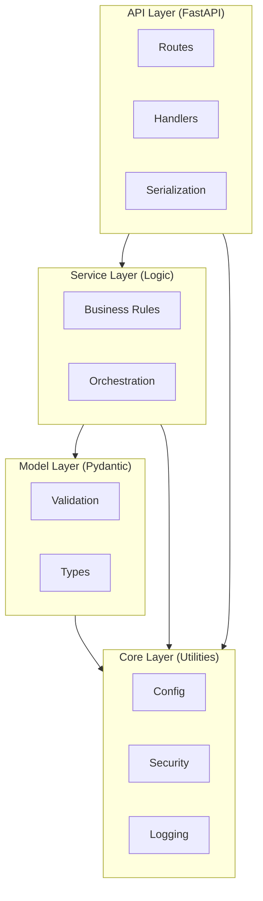
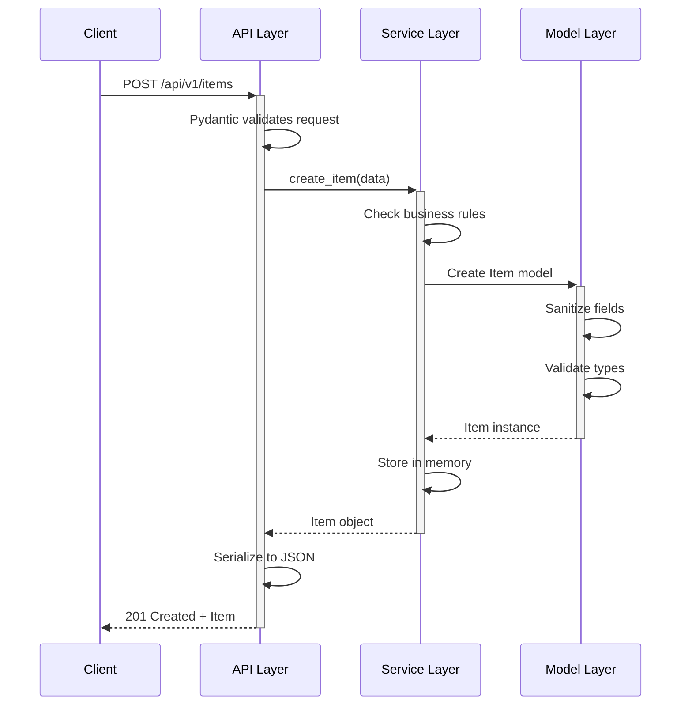
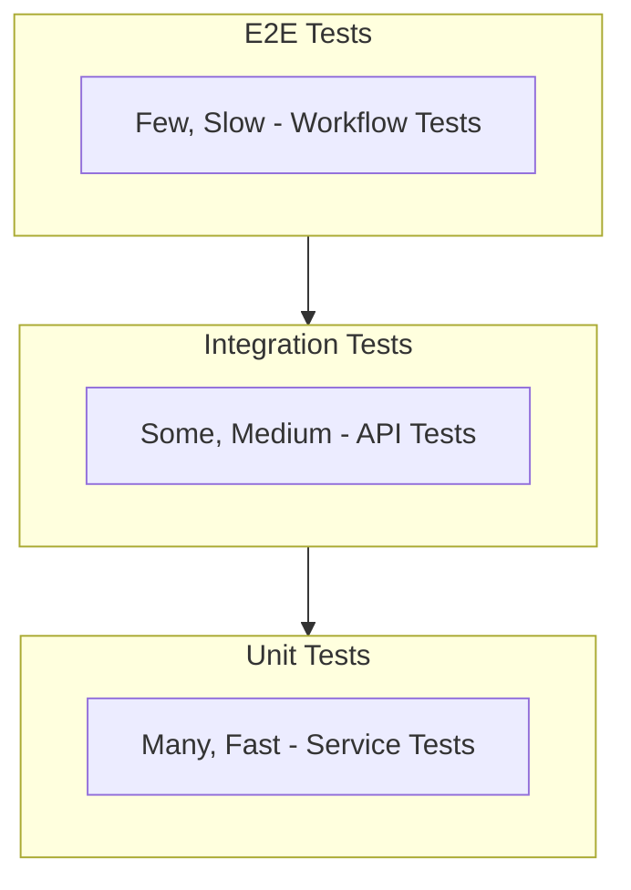

# Architecture

## Overview

The Ambient Code Reference Repository demonstrates a **layered architecture** with clear separation of concerns. This pattern scales from small microservices to large applications.

## Layered Architecture



### API Layer

**Location**: `app/api/`

**Responsibilities**:

- FastAPI route handlers
- Request/response models
- HTTP status codes
- Error responses
- OpenAPI documentation

**Example** (`app/api/v1/items.py`):

```python
@router.post("/", response_model=Item, status_code=201)
def create_item(data: ItemCreate) -> Item:
    try:
        return item_service.create_item(data)
    except ValueError as e:
        raise HTTPException(status_code=409, detail=str(e))
```

### Service Layer

**Location**: `app/services/`

**Responsibilities**:

- Business logic
- CRUD operations
- Data manipulation
- No HTTP concerns

**Example** (`app/services/item_service.py`):

```python
def create_item(self, data: ItemCreate) -> Item:
    if data.slug in self._slug_index:
        raise ValueError(f"Item with slug '{data.slug}' already exists")

    item = Item(
        id=self._next_id,
        name=data.name,
        slug=data.slug,
        description=data.description,
        created_at=datetime.utcnow(),
        updated_at=datetime.utcnow(),
    )

    self._items[item.id] = item
    self._slug_index[item.slug] = item.id
    self._next_id += 1

    return item
```

### Model Layer

**Location**: `app/models/`

**Responsibilities**:

- Pydantic models
- Field validation
- Type annotations
- Sanitization

**Example** (`app/models/item.py`):

```python
class ItemCreate(ItemBase):
    name: str = Field(..., min_length=1, max_length=200)
    slug: str = Field(..., min_length=1, max_length=100)

    @field_validator("name")
    @classmethod
    def sanitize_name(cls, v: str) -> str:
        return sanitize_string(v, max_length=200)
```

### Core Layer

**Location**: `app/core/`

**Responsibilities**:

- Configuration (Pydantic Settings)
- Security utilities
- Logging setup
- Shared utilities

**Example** (`app/core/config.py`):

```python
class Settings(BaseSettings):
    app_name: str = "Ambient Code Reference"
    api_v1_prefix: str = "/api/v1"

    class Config:
        env_file = ".env"

settings = Settings()
```

## Data Flow

### Creating an Item



## Design Patterns

### Singleton Services

Services use singleton pattern for shared state:

```python
# app/services/item_service.py
class ItemService:
    def __init__(self):
        self._items: dict[int, Item] = {}

item_service = ItemService()

# app/api/v1/items.py
from app.services.item_service import item_service
```

### Dependency Injection (Implicit)

FastAPI handles dependency injection:

```python
# Current: Implicit singleton
from app.services.item_service import item_service

# Future: Explicit DI
def create_item(
    data: ItemCreate,
    service: ItemService = Depends(get_item_service)
):
    return service.create_item(data)
```

### Validation Pipeline

Pydantic validators create a validation pipeline:

```python
class ItemCreate(ItemBase):
    @field_validator("name")  # Step 1
    @classmethod
    def sanitize_name(cls, v: str) -> str:
        return sanitize_string(v)

    @field_validator("slug")  # Step 2
    @classmethod
    def validate_slug_field(cls, v: str) -> str:
        return validate_slug(v)
```

## Security Architecture

### Input Validation

**Validate once at API boundary**:

- Pydantic models validate all request payloads
- Sanitization in model validators
- Trust internal code

### Sanitization Functions

**Location**: `app/core/security.py`

**Functions**:

- `sanitize_string()` - Remove control characters, trim whitespace
- `validate_slug()` - Ensure URL-safe slugs

### Secrets Management

**Environment variables only**:

```python
# .env (not committed)
SECRET_KEY=xxx

# app/core/config.py
class Settings(BaseSettings):
    secret_key: str

    class Config:
        env_file = ".env"
```

## Testing Architecture

### Test Pyramid



**Unit**: Test service layer in isolation
**Integration**: Test API with TestClient
**E2E**: Test complete CBA workflows (outline)

## Observability

### Structured Logging

JSON format for log aggregation:

```python
{
  "timestamp": "2025-12-17T12:00:00",
  "level": "INFO",
  "logger": "app.api.v1.items",
  "message": "Item created",
  "request_id": "abc123"
}
```

### Health Endpoints

- `/health` - Basic health check
- `/readiness` - Kubernetes readiness probe
- `/liveness` - Kubernetes liveness probe

## Scalability Considerations

### Current Design (Single Instance)

- In-memory storage
- No database
- Stateful (data lost on restart)

### Production Patterns

**Database**:

- Add SQLAlchemy models
- Repository pattern in service layer
- Migrations with Alembic

**Caching**:

- Redis for frequently accessed items
- Cache invalidation on updates

**Async**:

- Use `async def` for I/O-bound operations
- AsyncIO for concurrent requests

## Extension Points

### Adding a Resource

1. Create model in `app/models/resource.py`
2. Create service in `app/services/resource_service.py`
3. Create API in `app/api/v1/resource.py`
4. Register router in `app/main.py`
5. Add tests

### Adding Middleware

```python
# app/main.py
from fastapi import Request

@app.middleware("http")
async def add_request_id(request: Request, call_next):
    request.state.request_id = generate_id()
    response = await call_next(request)
    return response
```

### Adding Database

```python
# app/core/database.py
from sqlalchemy.ext.asyncio import create_async_engine

engine = create_async_engine(settings.database_url)
```

## Best Practices

✅ **DO**:

- Keep layers independent
- Validate at boundaries
- Use Pydantic for all data
- Write tests for each layer

❌ **DON'T**:

- Put business logic in API layer
- Put HTTP logic in service layer
- Bypass validation
- Mix concerns across layers
