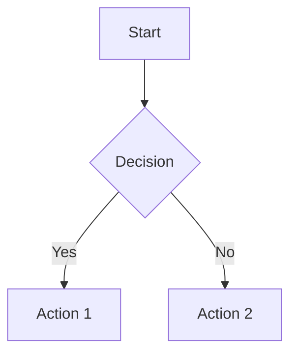

# Contributing to Ambient Code Reference Repository

Want to help improve this template? This guide explains how to contribute.

## What You Can Help With

**Documentation**:
- Fix typos or confusing explanations
- Add new documentation topics
- Improve Terry versions for better accessibility
- Add examples or troubleshooting tips

**Automation**:
- Improve existing scripts
- Add new validation checks
- Fix bugs in workflows

**Examples**:
- Add more diagrams
- Create additional tutorials
- Expand pattern documentation

## Before You Start

**What You'll Need**:
- Fork of this repository (your own copy on GitHub)
- Git installed on your computer
- Text editor
- Optional: Node.js for running validation tools

**Read These First**:
- [STYLE_GUIDE.md](STYLE_GUIDE.md) - How to write documentation
- [PROJECT_BOARD.md](../.github/PROJECT_BOARD.md) - How we organize work

## Quick Start

### Step 1: Fork the Repository

1. Go to the repository on GitHub
2. Click the "Fork" button (top right)
3. GitHub creates a copy under your account

**What Just Happened?**
You created your own version of the repository where you can make changes freely without affecting the original.

### Step 2: Clone Your Fork

```bash
git clone https://github.com/YOUR_USERNAME/reference.git
cd reference
```

Replace `YOUR_USERNAME` with your GitHub username.

**What Just Happened?**
You downloaded your forked repository to your computer so you can edit the files.

### Step 3: Create a Branch

```bash
git checkout -b feature/your-change-name
```

**Branch Naming Examples**:
- `feature/docs/quickstart-improvements` - Improving quickstart docs
- `fix/validate-mermaid-bug` - Fixing a bug
- `feature/cicd/new-security-check` - Adding a security check

**What Just Happened?**
You created a separate workspace (branch) for your changes. This keeps them organized and separate from the main code.

## Making Changes

### Adding Documentation

**Remember: Dual Documentation Required**

Every documentation topic needs TWO files:
1. Standard version: `docs/{topic}.md`
2. Terry version: `docs/{topic}-terry.md`

**Example: Adding "Deployment Patterns" Documentation**

1. Create `docs/deployment.md`:
```markdown
# Deployment

Containerization patterns using Podman.

## Container Build

```bash
podman build -t myapp:latest .
```

## Running Containers

```bash
podman run -p 8080:8080 myapp:latest
```
```

2. Create `docs/deployment-terry.md`:
```markdown
# Deployment: Getting Your Code Running

How to package and run your application using containers.

## What's a Container?

A container packages your application with everything it needs to run. Think of it like a portable box that works the same on any computer.

## Building a Container

```bash
podman build -t myapp:latest .
```

**What Just Happened?**
`podman build` created a container image named "myapp" with the tag "latest". The `.` means "use files in the current folder".

## Running Your Container

```bash
podman run -p 8080:8080 myapp:latest
```

**What Just Happened?**
`podman run` started the container. The `-p 8080:8080` means "port 8080 on your computer maps to port 8080 in the container".

## Troubleshooting

**Problem**: "command not found: podman"
**Solution**: Install Podman from [podman.io](https://podman.io/)
```

3. Validate:
```bash
./scripts/check-doc-pairs.sh
```

4. Add to comparison page:

Edit `docs/comparison/index.html`, find the `<nav>` section, add:
```html
<button class="tab-btn" data-topic="deployment">Deployment</button>
```

**What Just Happened?**
You created both versions, checked they exist, and added a navigation button so people can view them in the comparison page.

### Improving Existing Documentation

**Making Changes to Standard Version**:
1. Edit `docs/{topic}.md`
2. Test: `markdownlint docs/{topic}.md`

**Making Changes to Terry Version**:
1. Edit `docs/{topic}-terry.md`
2. Check for:
   - "What Just Happened?" sections after complex steps
   - Troubleshooting section at end
   - No unexplained jargon
3. Test: `markdownlint docs/{topic}-terry.md`

**What Just Happened?**
You improved the documentation while maintaining the dual-version requirement. Both versions stay in sync for the same topic.

### Adding Diagrams

1. Create `docs/diagrams/my-diagram.mmd`:


2. Validate:
```bash
./scripts/validate-mermaid.sh
```

3. Reference in documentation:
```markdown
See [architecture diagram](diagrams/my-diagram.mmd)
```

**What Just Happened?**
You created a text-based diagram using Mermaid syntax, validated it works, and linked it from your documentation.

**Common Mermaid Syntax Errors**:
- Missing semicolons in flowcharts
- Wrong arrow syntax (use `-->` not `->`)
- Spaces in node IDs (use `nodeOne` not `node One`)
- Unclosed quotes in labels

### Improving Scripts

1. Edit the script file (e.g., `scripts/validate-mermaid.sh`)
2. Test locally:
```bash
./scripts/validate-mermaid.sh
```
3. Run shellcheck:
```bash
shellcheck scripts/validate-mermaid.sh
```

**What shellcheck Does**:
Finds common mistakes in bash scripts like:
- Missing quotes around variables
- Using undefined variables
- Incorrect command syntax

**What Just Happened?**
You modified a script and validated it follows best practices before committing.

## Testing Your Changes

Before committing, always run:

```bash
# Check documentation pairs
./scripts/check-doc-pairs.sh

# Validate diagrams
./scripts/validate-mermaid.sh

# Check markdown formatting
markdownlint docs/*.md

# Check scripts
shellcheck scripts/*.sh
```

**Why This Matters**:
These same checks run automatically on GitHub when you create a pull request. Running them locally catches errors earlier.

## Saving Your Work

### Check What Changed

```bash
git status
```

Shows all files you modified.

### Add Files to Commit

```bash
# Add specific files
git add docs/deployment.md docs/deployment-terry.md

# Or add all changed files
git add -A
```

**What Just Happened?**
`git add` marks files to be included in your next commit (save point).

### Create Commit

```bash
git commit -m "feat(docs): add deployment patterns documentation

- Add standard version with Podman examples
- Add Terry version with container explanations
- Update comparison page navigation
- Verified with check-doc-pairs.sh

🤖 Generated with Claude Code
Co-Authored-By: Claude <noreply@anthropic.com>"
```

**Commit Message Format**:
- **feat** - new feature
- **fix** - bug fix
- **docs** - documentation changes
- **chore** - maintenance

**What Just Happened?**
`git commit` saved a snapshot of your changes with a descriptive message explaining what you did.

### Push to GitHub

```bash
git push -u origin feature/your-change-name
```

**What Just Happened?**
`git push` uploaded your branch to GitHub so others can see your changes.

## Creating a Pull Request

A pull request asks the maintainers to review and merge your changes.

### Via GitHub Website

1. Go to your fork on GitHub
2. Click "Pull requests" tab
3. Click "Compare & pull request" button
4. Fill in:
   - **Title**: Brief description (e.g., "feat(docs): add deployment patterns")
   - **Description**: What you changed and why
5. Click "Create pull request"

### Using GitHub CLI

```bash
gh pr create \
  --title "feat(docs): add deployment patterns" \
  --body "Adds dual documentation for container deployment with Podman examples"
```

**What Just Happened?**
You created a request for project maintainers to review your changes. They'll comment with feedback or approve and merge your contribution.

## Pull Request Checklist

Before submitting, verify:

- [ ] Both standard and Terry versions created (if documentation)
- [ ] `./scripts/check-doc-pairs.sh` passes
- [ ] `markdownlint` passes (no formatting errors)
- [ ] Diagrams validate with `./scripts/validate-mermaid.sh` (if applicable)
- [ ] Scripts pass `shellcheck` (if applicable)
- [ ] No Red Hat branding in your changes
- [ ] No "Amber" terminology (use "Codebase Agent" or "CBA" instead)
- [ ] Follows [STYLE_GUIDE.md](STYLE_GUIDE.md)
- [ ] Tested locally

## What Happens Next

### Review Process

1. **Automated Checks Run**: GitHub runs all validation workflows
2. **Maintainer Review**: A project maintainer reviews your code
3. **Feedback**: You might get requests for changes
4. **Approval**: Once approved, your PR gets merged
5. **Recognition**: Your name appears in contributors list!

**Timeline**:
- Initial review: Usually within 2 business days
- Follow-up reviews: Within 1 business day

### Making Changes After Review

If requested to make changes:

1. Make the edits on the same branch
2. Commit the changes:
```bash
git add -A
git commit -m "fix: address review feedback"
```
3. Push again:
```bash
git push
```

The pull request automatically updates with your new commits.

**What Just Happened?**
Pull requests are "live" - any new commits to the branch automatically show up in the PR. No need to create a new one.

## Common Contribution Types

### Fixing a Typo

1. Edit the file
2. Check formatting: `markdownlint <file>`
3. Commit: `git commit -m "docs: fix typo in quickstart guide"`
4. Push and create PR

**Simple and Quick** - Most typo fixes get merged same day!

### Adding an Example

1. Find the relevant documentation file
2. Add your example to both standard and Terry versions
3. Test the example works
4. Commit and create PR

**Helpful** - Real examples make documentation much better!

### Reporting a Bug

Don't know how to fix it? That's okay!

1. Go to GitHub Issues
2. Click "New issue"
3. Choose "Bug report" template
4. Fill in:
   - What you expected to happen
   - What actually happened
   - Steps to reproduce
5. Submit

**Still Helpful** - Reporting bugs helps even if you can't fix them!

## Troubleshooting

**Problem**: "My pull request has merge conflicts"
**Solution**:
```bash
# Update your branch with latest changes
git checkout main
git pull upstream main
git checkout feature/your-change-name
git merge main
# Fix any conflicts in your editor
git add -A
git commit -m "merge: resolve conflicts with main"
git push
```

**Problem**: "Automated checks are failing"
**Solution**:
1. Click "Details" next to the failing check
2. Read the error message
3. Fix the issue locally
4. Commit and push the fix

**Problem**: "I accidentally committed to main instead of a branch"
**Solution**:
```bash
# Create a new branch with your changes
git checkout -b feature/my-changes

# Reset main branch
git checkout main
git reset --hard origin/main

# Push your feature branch
git push -u origin feature/my-changes
```

## Code of Conduct

Be respectful and constructive:

**Good Examples**:
- "I noticed a typo here, should be 'environment' not 'enviroment'"
- "This explanation could be clearer - maybe add an example?"
- "Great contribution! Minor suggestion: add error handling here"

**Not Okay**:
- Personal attacks or insults
- Dismissive comments ("this is wrong", "bad code")
- Harassment of any kind

**Enforcement**:
- First offense: Warning
- Repeated violations: Temporary ban
- Severe violations: Permanent ban

## Recognition

Contributors are recognized in:
- GitHub contributors graph
- Release notes
- Project README (for significant contributions)

## Learning Resources

**Git Basics**:
- [GitHub's Git Handbook](https://guides.github.com/introduction/git-handbook/)
- [Pro Git Book](https://git-scm.com/book/en/v2) (free online)

**Markdown**:
- [Markdown Guide](https://www.markdownguide.org/)
- [GitHub Flavored Markdown](https://github.github.com/gfm/)

**Writing Accessible Docs**:
- [Write the Docs](https://www.writethedocs.org/)
- [18F Content Guide](https://content-guide.18f.gov/)

## Questions?

- **General Questions**: [GitHub Discussions](../../discussions)
- **Bug Reports**: [GitHub Issues](../../issues)
- **Real-Time Help**: Check if project has Discord/Slack (if listed in README)

---

**Thank you for contributing!** Every improvement, no matter how small, makes this template better for everyone.
