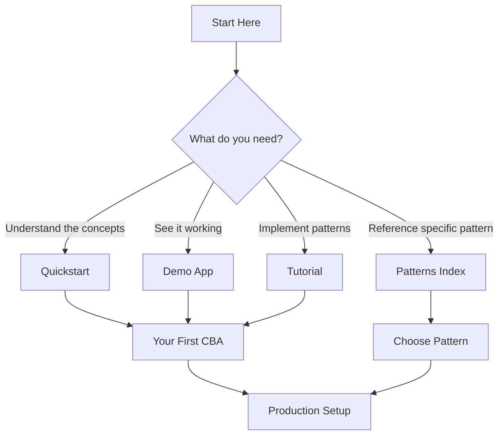

# Ambient Code Reference

**AI-assisted development patterns for engineering teams.**

---

## Executive Summary

This repository provides battle-tested patterns for adopting AI-assisted development at scale. It answers the question every principal engineer faces: *"How do we use AI coding assistants without creating chaos?"*

**Key Value Propositions:**

1. **Consistency** - Every AI interaction follows the same process
2. **Safety** - Human review gates prevent runaway automation
3. **Productivity** - 10x speedup for routine tasks
4. **Transferability** - Patterns work across tools and languages

**Approach:** Standalone patterns. Adopt what you need, skip what you don't. No prescribed sequence.

---

## What's Inside

### Patterns (9 Total)

| Pattern | Category | Effort | Impact |
|---------|----------|--------|--------|
| [Codebase Agent (CBA)](patterns/codebase-agent.md) | Agent Behavior | Medium | High |
| [Memory System](getting-started/first-cba.md) | Agent Behavior | Low | Medium |
| [Self-Review Reflection](patterns/self-review-reflection.md) | Agent Behavior | Low | High |
| [Issue-to-PR Automation](patterns/issue-to-pr.md) | GHA Automation | High | Very High |
| [PR Auto-Review](patterns/pr-auto-review.md) | GHA Automation | Medium | High |
| [Dependabot Auto-Merge](patterns/dependabot-auto-merge.md) | GHA Automation | Low | Medium |
| [Stale Issue Management](patterns/stale-issues.md) | GHA Automation | Low | Medium |
| [Layered Architecture](patterns/layered-architecture.md) | Foundation | Low | Medium |
| [Security Patterns](patterns/security-patterns.md) | Foundation | Low | Medium |

### Quick Start Paths

=== "I want consistent AI assistance"

    Start with [Codebase Agent](patterns/codebase-agent.md) - one file that defines how AI works in your codebase.

=== "AI keeps forgetting my conventions"

    Start with [Memory System](getting-started/first-cba.md) - modular context files that persist across sessions.

=== "Routine fixes take too long"

    Start with [Issue-to-PR Automation](patterns/issue-to-pr.md) - convert well-defined issues to PRs automatically.

=== "I want to see it working first"

    Check out the [demo-fastapi](https://github.com/jeremyeder/demo-fastapi) repository for a working example.

---

## Documentation Structure

### Getting Started

| Section | Purpose | Time |
|---------|---------|------|
| [Quickstart](quickstart.md) | 5-minute introduction to AI-assisted development | 5 min |
| [Installation](getting-started/installation.md) | Set up tooling and dependencies | 15 min |
| [Your First CBA](getting-started/first-cba.md) | Create your first Codebase Agent | 30 min |

**What you'll learn:** How to copy the `.claude/` directory to your project and customize it for your tech stack.

---

### Patterns

#### Agent Behavior Patterns

How AI agents behave during development.

| Pattern | What It Does | Section Summary |
|---------|--------------|-----------------|
| [Codebase Agent](patterns/codebase-agent.md) | Defines AI behavior, capabilities, and guardrails | Agent definition structure, autonomy levels, workflow examples, capability boundaries |
| [Self-Review Reflection](patterns/self-review-reflection.md) | Agent reviews own work before presenting | Reflection loop, checklist criteria, implementation prompts, anti-patterns |
| [Autonomous Quality](patterns/autonomous-quality-enforcement.md) | Validates code quality before delivery | Lint loops, test verification, error budgets |
| [Multi-Agent Review](patterns/multi-agent-code-review.md) | Multiple specialized agents review in parallel | Agent roles, consensus mechanisms, conflict resolution |

#### GHA Automation Patterns

Proactive CI/CD workflows.

| Pattern | Trigger | Section Summary |
|---------|---------|-----------------|
| [Issue-to-PR](patterns/issue-to-pr.md) | `issues.opened` | Requirements analysis, draft PR creation, risk categories, safety gates |
| [PR Auto-Review](patterns/pr-auto-review.md) | `pull_request` | AI review format, severity levels, when to block vs comment |
| [Dependabot Auto-Merge](patterns/dependabot-auto-merge.md) | `pull_request` | Patch vs minor/major, CI requirements, safety conditions |
| [Stale Issues](patterns/stale-issues.md) | `schedule` | Inactivity thresholds, warning periods, exempt labels |

#### Foundation Patterns

Enabling patterns that make AI more effective.

| Pattern | Purpose | Section Summary |
|---------|---------|-----------------|
| [Layered Architecture](patterns/layered-architecture.md) | Code structure AI can reason about | Four layers, dependency rules, component responsibilities |
| [Security Patterns](patterns/security-patterns.md) | Practical protection without over-engineering | Boundary validation, sanitization, secrets management |
| [Testing Patterns](patterns/testing-patterns.md) | Test pyramid approach | Unit/integration/E2E, coverage targets, AI test generation |

---

### Reference

| Section | Purpose | Contents |
|---------|---------|----------|
| [Architecture](architecture.md) | Deep dive into architecture patterns | Data flow diagrams, layer boundaries, extension points |
| [API Patterns](api-reference.md) | API design for AI-assisted development | Request/response patterns, error handling, OpenAPI |
| [ADR Template](adr/template.md) | Decision record scaffolding | YYYYMMDD-title.md format, context/decision/consequences |

---

### Tutorial

| Section | Purpose | Time |
|---------|---------|------|
| [Full Tutorial](tutorial.md) | Step-by-step implementation guide | 2-4 hours |

**What you'll build:** A complete AI-assisted development setup from scratch, including CBA, memory system, and GHA automations.

---

### Resources

| Resource | Format | Purpose |
|----------|--------|---------|
| [Presentation](resources/presentation.md) | Markdown | NotebookLM podcast generation, 9 features explained |
| [Demo Application](resources/demo-app.md) | GitHub Repo | Working FastAPI example |

---

## Navigation Guide

---

## Design Principles

1. **Standalone patterns** - No dependencies between patterns. Adopt one without adopting others.
2. **Copy-paste ready** - All configurations are complete and ready to customize.
3. **Human-in-the-loop** - AI assists, humans decide. Safety gates everywhere.
4. **Vendor-agnostic** - Patterns work with any AI tool or none at all.
5. **Minimal ceremony** - Start small, add complexity only when needed.

---

## Who This Is For

| Role | Benefit |
|------|---------|
| **Principal Engineers** | Evaluate AI adoption strategy with battle-tested patterns |
| **Team Leads** | Implement consistent AI workflows across your team |
| **Senior Developers** | Get productivity gains without sacrificing quality |
| **Junior Developers** | Get senior-level AI assistance with guardrails |

---

## Quick Links

- **GitHub Repository**: [jeremyeder/reference](https://github.com/jeremyeder/reference)
- **Demo Application**: [jeremyeder/demo-fastapi](https://github.com/jeremyeder/demo-fastapi)
- **Original SRE Coloring Book**: [red.ht/sre-coloring-book](https://red.ht/sre-coloring-book)

---

*"Stable, Secure, Performant, and Boring" - the goal is to make AI assistance invisible through excellence.*
