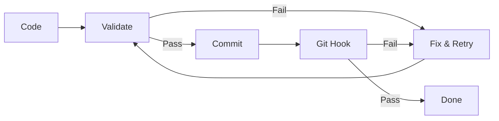

# Autonomous Quality Enforcement (AQE)

**Pattern**: Ensure AI-generated code is production-ready before showing it to users.

**Problem**: AI agents present broken or untested code, causing frustrating back-and-forth cycles. Users waste time debugging code that should have been validated first.

**Solution**: Build validation into the agent workflow. Code gets tested before presentation, fixed autonomously when possible, and blocked at commit time as a final safety net.

---

## Quick Start (5 Minutes)

Get a working validation loop in your project:

### Step 1: Create Validation Script (1 min)

```bash
mkdir -p scripts/validation
cat > scripts/validation/check.sh << 'EOF'
#!/bin/bash
set -e
echo "Running validation..."

# Add your checks here:
npm run lint 2>&1 || exit 1
npm run test 2>&1 || exit 1

echo "All checks passed"
EOF
chmod +x scripts/validation/check.sh
```

### Step 2: Create Autonomous Loop (1 min)

```bash
cat > scripts/validation/auto-fix.sh << 'EOF'
#!/bin/bash
set -e
MAX=3
for i in $(seq 1 $MAX); do
  echo "Attempt $i/$MAX"
  if ./scripts/validation/check.sh; then
    echo "Validation passed"
    exit 0
  fi
  echo "Failed - fix and re-run"
  exit 1
done
EOF
chmod +x scripts/validation/auto-fix.sh
```

### Step 3: Add Git Hook (1 min)

```bash
cat > .git/hooks/pre-commit << 'EOF'
#!/bin/bash
./scripts/validation/check.sh
EOF
chmod +x .git/hooks/pre-commit
```

### Step 4: Test It (2 min)

```bash
# Run validation manually
./scripts/validation/auto-fix.sh

# Try to commit - hook will validate
git add . && git commit -m "test"
```

**Done!** You now have autonomous validation with a git hook safety net.

### Next Steps

- Customize `check.sh` for your project's linting/testing
- Add process rule reminders (see Process Rules section)
- Add more validation types (security, types, etc.)

---

## How It Works

AQE combines three mechanisms that reinforce each other:



| Component | Purpose | When It Runs |
| --------- | ------- | ------------ |
| **Process Rules** | Remind agent to validate | During development |
| **Validation Loops** | Fix failures autonomously | Before presenting code |
| **Git Hooks** | Final safety net | At commit time |

All three use the **same validation scripts**. One source of truth.

---

## Process Rules

Process rules are instructions in your agent configuration that remind it to validate code.

### Example: CLAUDE.md Process Rule

```markdown
## Code Quality Rules

**MANDATORY**: Before presenting ANY code to the user:

1. Run `./scripts/validation/check.sh`
2. If validation fails, fix the issue and re-run
3. Maximum 3 fix attempts before asking user for help
4. NEVER present code that hasn't passed validation
```

### Why Process Rules Matter

- **Proactive, not reactive**: Catches issues before user sees them
- **Self-correcting**: Agent fixes its own mistakes
- **Configurable tolerance**: Set max iterations based on project needs

---

## Validation Loops

The autonomous fix loop is the core mechanism. When validation fails, the agent:

1. Analyzes the error output
2. Identifies the root cause
3. Applies a fix
4. Re-runs validation
5. Repeats until success or max iterations reached

See the demo-fastapi repository for a reference implementation of the autonomous fix loop.

---

## Git Hooks

Git hooks are the final safety net. Even if process rules are ignored, broken code cannot be committed.

### Pre-commit Hook

```bash
#!/bin/bash
# .git/hooks/pre-commit

echo "Running pre-commit validation..."

if ! ./scripts/validation/check.sh; then
    echo ""
    echo "Commit blocked: validation failed"
    echo "Run './scripts/validation/check.sh' to see errors"
    exit 1
fi

echo "Pre-commit validation passed"
```

### Setting Up Hooks

```bash
# Make hook executable
chmod +x .git/hooks/pre-commit

# Verify hook is active
ls -la .git/hooks/pre-commit

# Test the hook
git add . && git commit -m "test"  # Will run validation
```

---

## Measuring Success

### Key Metrics

| Metric | Before AQE | Target | How to Measure |
| ------ | ---------- | ------ | -------------- |
| Broken code presentations | 2-5 per feature | 0 | Count user-reported crashes |
| "Try this fix" iterations | 3-5 per bug | 0-1 | Count back-and-forth cycles |
| Time to working code | Variable | First presentation | Track presentation-to-approval time |
| Commits blocked by hooks | N/A | >0 | Git hook rejection count |

### Anti-Metrics (What NOT to Optimize)

- Validation speed at cost of coverage
- Skipping hooks to "move faster"
- Reducing max iterations to avoid fixing hard bugs

---

## When Things Go Wrong

### Failure Mode 1: Infinite Loop

**Symptom**: Validation keeps failing, AI keeps "fixing" but never succeeds.

**Causes**:

- Test is flaky (passes/fails randomly)
- Fix creates new bug that causes different failure
- Underlying issue requires human judgment

**Solution**:

```bash
# Set max iterations in your loop script
MAX_ITERATIONS=3  # Stop after 3 attempts

# Add circuit breaker
if [ $iteration -ge $MAX_ITERATIONS ]; then
    echo "Max iterations reached"
    echo "Manual intervention required"
    echo "Last error: $LAST_ERROR"
    exit 1
fi
```

### Failure Mode 2: Git Hook Bypass

**Symptom**: Broken code ends up in git despite hooks.

**Causes**:

- User ran `git commit --no-verify`
- Hook file not executable
- Hook path misconfigured

**Solution**:

```bash
# Verify hook is active
ls -la .git/hooks/pre-commit  # Should be executable

# Check hook path
git config core.hooksPath  # Should be empty or .git/hooks

# Add CI as final safety net (see CI/CD section)
```

---

## CI/CD Integration

The same validation scripts used locally should run in CI. One source of truth.

### GitHub Actions Example

```yaml
# .github/workflows/validate.yml
name: Validate

on:
  push:
    branches: [main]
  pull_request:
    branches: [main]

jobs:
  validate:
    runs-on: ubuntu-latest
    steps:
      - uses: actions/checkout@v4

      - name: Setup
        run: npm ci

      - name: Run Validation
        run: ./scripts/validation/check.sh

      - name: Comment on PR Failure
        if: failure() && github.event_name == 'pull_request'
        uses: actions/github-script@v7
        with:
          script: |
            github.rest.issues.createComment({
              issue_number: context.issue.number,
              owner: context.repo.owner,
              repo: context.repo.repo,
              body: 'Validation failed. Run `./scripts/validation/check.sh` locally to debug.'
            })
```

### Branch Protection

Require validation to pass before merge:

1. Go to Settings > Branches > Branch protection rules
2. Enable "Require status checks to pass"
3. Select your validation workflow

### Key Principle

**Same scripts everywhere**:

- Local development: `./scripts/validation/check.sh`
- Git hooks: `./scripts/validation/check.sh`
- CI/CD: `./scripts/validation/check.sh`

No divergence. If CI fails, local will fail too.

---

## Benefits

| Benefit | Description |
| ------- | ----------- |
| **Zero broken presentations** | Users only see working code |
| **Faster iteration** | Agent self-corrects before asking for help |
| **Clean git history** | Broken commits never enter the repository |
| **Consistent quality** | Same standards enforced everywhere |
| **Reduced cognitive load** | No manual validation steps to remember |

---

## Related Patterns

- [Self-Review Reflection](self-review-reflection.md) - Agent self-reviews before presenting work
- [Multi-Agent Code Review](multi-agent-code-review.md) - Parallel agent review before presentation
