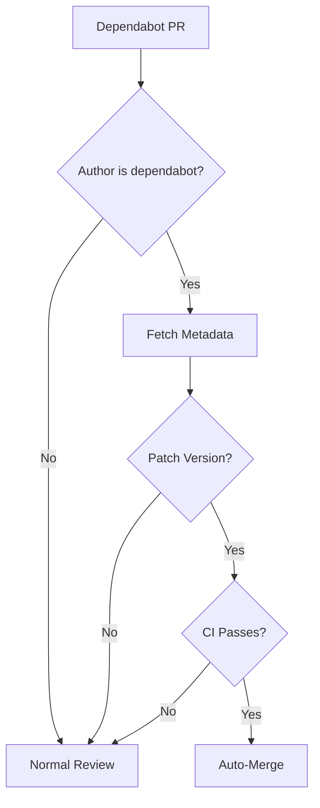

# Dependabot Auto-Merge

**Automatically merge low-risk dependency updates.**

---

## Quick Start

Create `.github/workflows/dependabot-auto-merge.yml`:

```yaml
name: Dependabot Auto-Merge

on:
  pull_request:
    types: [opened, synchronize, reopened]

permissions:
  contents: write
  pull-requests: write

jobs:
  auto-merge:
    if: github.actor == 'dependabot[bot]'
    runs-on: ubuntu-latest
    steps:
      - name: Fetch metadata
        id: metadata
        uses: dependabot/fetch-metadata@v2
        with:
          github-token: ${{ secrets.GITHUB_TOKEN }}

      - name: Auto-merge patch updates
        if: steps.metadata.outputs.update-type == 'version-update:semver-patch'
        run: gh pr merge --auto --squash "$PR_URL"
        env:
          PR_URL: ${{ github.event.pull_request.html_url }}
          GH_TOKEN: ${{ secrets.GITHUB_TOKEN }}
```

Enable Dependabot in `.github/dependabot.yml`. Set up branch protection requiring CI to pass.

---

## How It Works



---

## Update Types

| Type | Value | Risk | Default Action |
|------|-------|------|----------------|
| Patch | `version-update:semver-patch` | Low | Auto-merge |
| Minor | `version-update:semver-minor` | Medium | Human review |
| Major | `version-update:semver-major` | High | Human review |

---

## Options

| Option | Add to workflow |
|--------|-----------------|
| **Also merge minor** | Add step with `if: steps.metadata.outputs.update-type == 'version-update:semver-minor'` |
| **Only dev deps** | Add `&& steps.metadata.outputs.dependency-type == 'direct:development'` |
| **Exclude packages** | Check `steps.metadata.outputs.dependency-names` doesn't contain package |

---

## Troubleshooting

| Problem | Fix |
|---------|-----|
| Auto-merge not triggering | Use `pull_request_target` event for fork PRs |
| Permission denied | Add `contents: write` permission |
| Doesn't wait for CI | Enable branch protection with required status checks |

---

## Related Patterns

- [Stale Issue Management](stale-issues.md)
