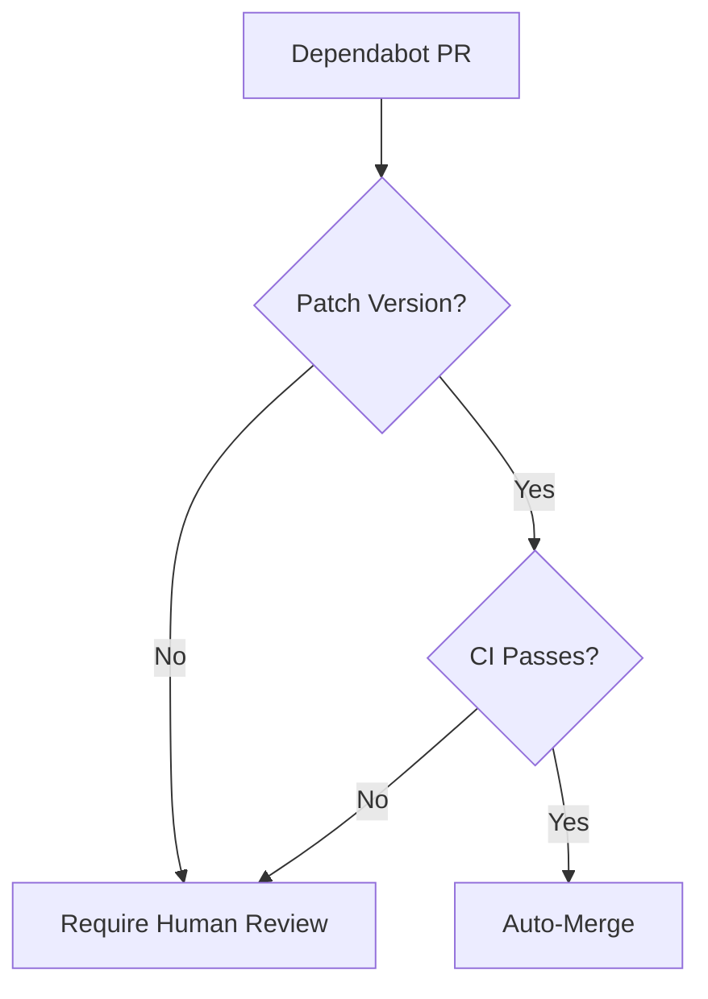

# Dependabot Auto-Merge

**Automatically merge low-risk dependency updates.**

---

## Overview

!!! note "Section Summary"
    When Dependabot creates a PR for a patch version update, auto-merge after CI passes. Keep dependencies current without manual effort. Minor/major updates still require human review.

---

## Quick Start

!!! note "Section Summary"
    Copy the workflow YAML. No additional secrets needed. Enable Dependabot in your repo. Watch patch updates auto-merge.

---

## How It Works

---

## Safety Conditions

!!! note "Section Summary"
    Only auto-merge when ALL conditions met: author is dependabot[bot], update is patch version, all CI checks pass, no merge conflicts. Why each condition matters.

---

## Workflow YAML

!!! note "Section Summary"
    Complete workflow file. Dependabot metadata action. Conditional auto-merge. Squash and delete branch.

---

## Customization

!!! note "Section Summary"
    Auto-merge minor versions too. Exclude specific packages. Custom merge strategy. Notifications.

---

## Related Patterns

- [Stale Issue Management](stale-issues.md) - Another proactive cleanup pattern
