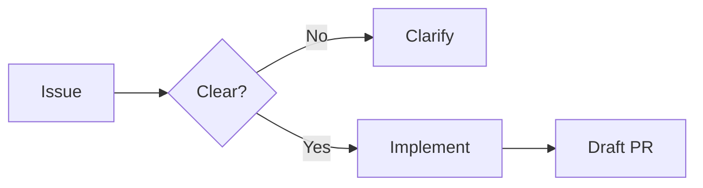
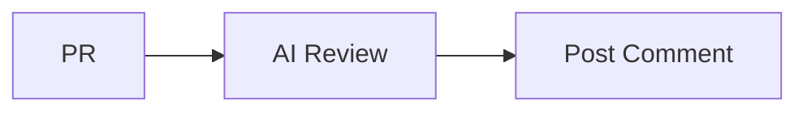
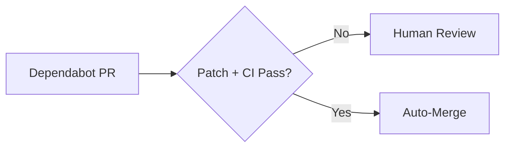
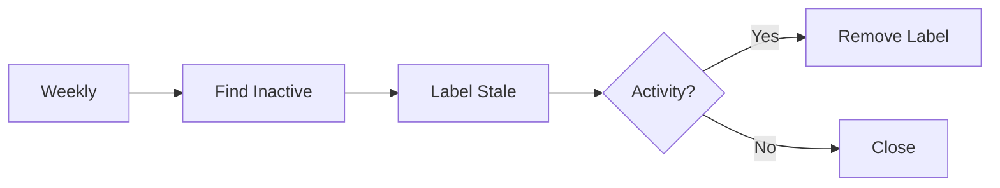

# GitHub Actions Automation Patterns

**Pattern**: Proactive CI/CD workflows that automate routine development tasks.

**Problem**: Manual processes slow down development - reviewing PRs, creating PRs from issues, merging dependency updates, cleaning up stale issues. Teams spend time on toil instead of building.

**Solution**: GitHub Actions workflows that trigger on repository events and handle routine work automatically. AI reviews code, issues become PRs, safe updates auto-merge, stale issues get cleaned up.

---

## Issue-to-PR Automation

Convert well-defined issues into draft pull requests automatically.

### How It Works



### Implementation

```yaml
# .github/workflows/issue-to-pr.yml
name: Issue to Draft PR

on:
  issues:
    types: [opened, labeled]

permissions:
  contents: write
  pull-requests: write
  issues: write

jobs:
  create-pr:
    if: contains(github.event.label.name, 'ready-for-pr') || github.event.action == 'opened'
    runs-on: ubuntu-latest
    steps:
      - uses: actions/checkout@v4

      - name: Analyze issue
        id: analyze
        uses: anthropics/claude-code-action@v1
        with:
          anthropic_api_key: ${{ secrets.ANTHROPIC_API_KEY }}
          prompt: |
            Analyze issue #${{ github.event.issue.number }}: ${{ github.event.issue.title }}

            Issue body:
            ${{ github.event.issue.body }}

            Determine if this issue is actionable:
            1. Are requirements clear?
            2. Is scope well-defined?
            3. Any security concerns?

            Write decision to analysis-decision.txt:
            - "create_pr" if ready for implementation
            - "needs_clarification" if requirements unclear

            Write reasoning to analysis-reasoning.txt (2-3 lines).

      - name: Check decision
        id: check
        run: |
          if [ -f analysis-decision.txt ]; then
            echo "decision=$(cat analysis-decision.txt)" >> $GITHUB_OUTPUT
          fi

      - name: Create draft PR
        if: steps.check.outputs.decision == 'create_pr'
        env:
          GH_TOKEN: ${{ github.token }}
        run: |
          ISSUE_NUM="${{ github.event.issue.number }}"
          BRANCH="feat/issue-${ISSUE_NUM}"

          git checkout -b "$BRANCH"
          git push origin "$BRANCH"

          gh pr create \
            --draft \
            --title "[Draft] Issue #${ISSUE_NUM}: ${{ github.event.issue.title }}" \
            --body "Auto-generated from issue #${ISSUE_NUM}. See issue for requirements."
```

---

## PR Auto-Review

AI-powered code review on every pull request.

### Workflow



### Workflow YAML

```yaml
# .github/workflows/pr-review.yml
name: PR Auto-Review

on:
  pull_request:
    types: [opened, synchronize]

permissions:
  contents: read
  pull-requests: write

jobs:
  review:
    runs-on: ubuntu-latest
    steps:
      - uses: actions/checkout@v4

      - name: Review code
        uses: anthropics/claude-code-action@v1
        with:
          anthropic_api_key: ${{ secrets.ANTHROPIC_API_KEY }}
          prompt: |
            Review pull request #${{ github.event.pull_request.number }}.

            Focus on:
            - Security issues (input validation, injection, secrets)
            - Bug risks (edge cases, error handling)
            - Code quality (clarity, maintainability)

            Post a review comment with findings. Use format:
            🔴 CRITICAL: [issue] - must fix
            🟡 WARNING: [issue] - should consider
            ✅ GOOD: [positive observation]

            Be concise. Only flag issues you're confident about.
```

---

## Dependabot Auto-Merge

Automatically merge low-risk dependency updates.

### Flow



### Auto-Merge YAML

```yaml
# .github/workflows/dependabot-auto-merge.yml
name: Dependabot Auto-Merge

on:
  pull_request:
    types: [opened, synchronize]

permissions:
  contents: write
  pull-requests: write

jobs:
  auto-merge:
    if: github.actor == 'dependabot[bot]'
    runs-on: ubuntu-latest
    steps:
      - name: Get Dependabot metadata
        id: metadata
        uses: dependabot/fetch-metadata@v2
        with:
          github-token: ${{ secrets.GITHUB_TOKEN }}

      - name: Auto-merge patch updates
        if: steps.metadata.outputs.update-type == 'version-update:semver-patch'
        env:
          GH_TOKEN: ${{ github.token }}
        run: |
          gh pr merge "${{ github.event.pull_request.number }}" \
            --auto \
            --squash \
            --delete-branch
```

### Safety Conditions

Only auto-merge when ALL conditions met:

- ✅ PR author is `dependabot[bot]`
- ✅ Update is patch version (x.x.PATCH)
- ✅ All CI checks pass
- ✅ No merge conflicts

For minor/major updates: require human review.

---

## Stale Issue Management

Clean up inactive issues automatically.

### Process



### Stale YAML

```yaml
# .github/workflows/stale-issues.yml
name: Stale Issue Management

on:
  schedule:
    - cron: '0 0 * * 0'  # Weekly on Sunday midnight UTC
  workflow_dispatch:  # Manual trigger

permissions:
  issues: write
  pull-requests: write

jobs:
  stale:
    runs-on: ubuntu-latest
    steps:
      - uses: actions/stale@v9
        with:
          stale-issue-message: |
            This issue has been inactive for 30 days.
            It will be closed in 7 days if there's no activity.
            Comment to keep it open.
          stale-pr-message: |
            This PR has been inactive for 14 days.
            It will be closed in 7 days if there's no activity.
          days-before-stale: 30
          days-before-close: 7
          stale-issue-label: 'stale'
          stale-pr-label: 'stale'
          exempt-issue-labels: 'pinned,security,bug'
          exempt-pr-labels: 'pinned,security'
```

---

## Required Secrets

| Secret | Used By | Purpose |
|--------|---------|---------|
| `ANTHROPIC_API_KEY` | Issue-to-PR, PR Review | AI analysis |
| `GITHUB_TOKEN` | All workflows | Repository access (auto-provided) |

---

## Related Patterns

- [Self-Review Reflection](self-review-reflection.md) - Agent self-review before presenting work
- [Autonomous Quality Enforcement](autonomous-quality-enforcement.md) - Validation loops
