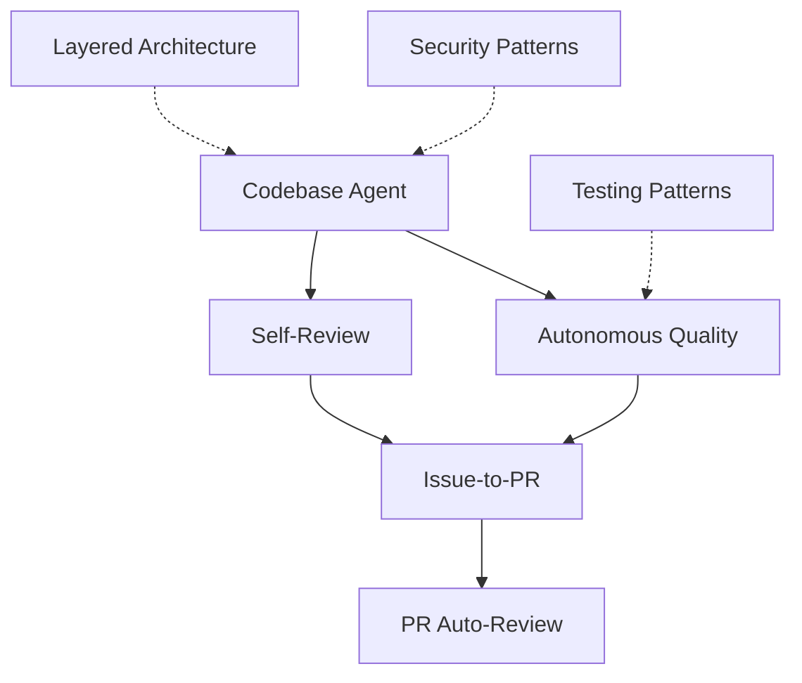

# Patterns Index

Each pattern is standalone—adopt what you need.

---

## Agent Behavior

| Pattern | Effort | Impact |
|---------|--------|--------|
| [Codebase Agent](codebase-agent.md) | Medium | High |
| [Self-Review Reflection](self-review-reflection.md) | Low | High |
| [Autonomous Quality Enforcement](autonomous-quality-enforcement.md) | Medium | High |
| [Multi-Agent Code Review](multi-agent-code-review.md) | High | Very High |

---

## GHA Automation

| Pattern | Trigger | Effort |
|---------|---------|--------|
| [Issue-to-PR](issue-to-pr.md) | `issues.opened` | High |
| [PR Auto-Review](pr-auto-review.md) | `pull_request` | Medium |
| [Dependabot Auto-Merge](dependabot-auto-merge.md) | `pull_request` | Low |
| [Stale Issue Management](stale-issues.md) | `schedule` | Low |

---

## Foundation

| Pattern | Purpose |
|---------|---------|
| [Layered Architecture](layered-architecture.md) | Code structure AI can reason about |
| [Security Patterns](security-patterns.md) | Validate at boundaries |
| [Testing Patterns](testing-patterns.md) | Test pyramid approach |

---

## Start Here

| Pain Point | Pattern |
|------------|---------|
| AI gives inconsistent answers | [Codebase Agent](codebase-agent.md) |
| AI misses obvious bugs | [Self-Review Reflection](self-review-reflection.md) |
| PRs take forever to create | [Issue-to-PR](issue-to-pr.md) |
| Code reviews are bottleneck | [PR Auto-Review](pr-auto-review.md) |
| Dependency updates pile up | [Dependabot Auto-Merge](dependabot-auto-merge.md) |

---

## Pattern Dependencies

---

## Quick Reference

| File | Location |
|------|----------|
| CBA definition | `.claude/agents/codebase-agent.md` |
| Context files | `.claude/context/*.md` |
| Issue-to-PR | `.github/workflows/issue-to-pr.yml` |
| PR Review | `.github/workflows/pr-review.yml` |
| Dependabot | `.github/workflows/dependabot-auto-merge.yml` |
| Stale | `.github/workflows/stale.yml` |

| Secret | Used By |
|--------|---------|
| `ANTHROPIC_API_KEY` | Issue-to-PR, PR Review |
| `GITHUB_TOKEN` | All workflows (auto-provided) |
