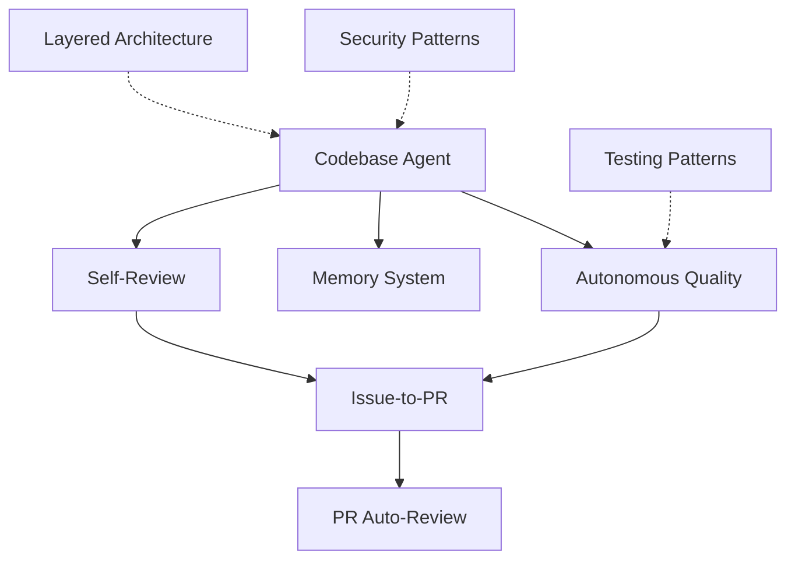

# Patterns Index

**All AI-assisted development patterns in one place.**

---

## Overview

!!! note "Section Summary"
    Patterns are organized into three categories: Agent Behavior (how AI works), GHA Automation (proactive CI/CD), and Foundation (enabling patterns). Each pattern is standalone - adopt what you need.

---

## Agent Behavior Patterns

How AI agents behave during development.

| Pattern | Effort | Impact | Description |
|---------|--------|--------|-------------|
| [Codebase Agent](codebase-agent.md) | Medium | High | Single source of truth for AI behavior |
| [Self-Review Reflection](self-review-reflection.md) | Low | High | Agent reviews own work before presenting |
| [Autonomous Quality Enforcement](autonomous-quality-enforcement.md) | Medium | High | Validate code before delivery |
| [Multi-Agent Code Review](multi-agent-code-review.md) | High | Very High | Parallel specialized reviews |

---

## GHA Automation Patterns

Proactive CI/CD workflows that reduce toil.

| Pattern | Trigger | Effort | Impact |
|---------|---------|--------|--------|
| [Issue-to-PR](issue-to-pr.md) | `issues.opened` | High | Very High |
| [PR Auto-Review](pr-auto-review.md) | `pull_request` | Medium | High |
| [Dependabot Auto-Merge](dependabot-auto-merge.md) | `pull_request` | Low | Medium |
| [Stale Issue Management](stale-issues.md) | `schedule` | Low | Medium |

---

## Foundation Patterns

Patterns that make AI more effective.

| Pattern | Purpose | Effort | Impact |
|---------|---------|--------|--------|
| [Layered Architecture](layered-architecture.md) | Code structure AI can reason about | Low | Medium |
| [Security Patterns](security-patterns.md) | Practical protection | Low | Medium |
| [Testing Patterns](testing-patterns.md) | Test pyramid approach | Medium | High |

---

## Adoption Matrix

!!! note "Section Summary"
    Decision tree for which patterns to adopt based on your situation. Pain point → recommended pattern mapping. Effort/impact quadrant visualization.

---

## Pattern Dependencies

Solid arrows: recommended order. Dashed arrows: optional dependencies.

---

## Quick Reference

!!! note "Section Summary"
    One-page cheat sheet of all patterns with key commands and file paths. Printable format.
