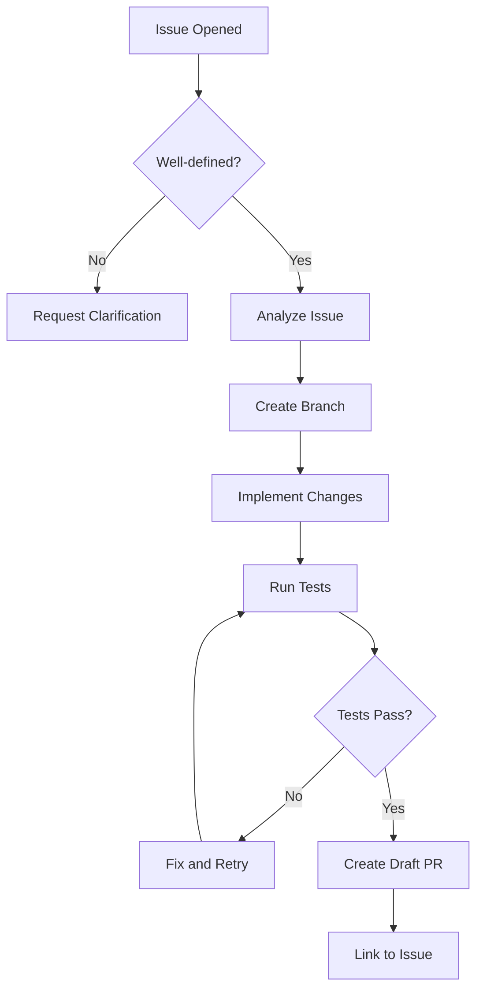

# Issue-to-PR Automation

**Convert well-defined issues to draft PRs automatically.**

---

## Quick Start

Create `.github/workflows/issue-to-pr.yml`:

```yaml
name: Issue to Draft PR

on:
  issues:
    types: [opened, labeled]

permissions:
  contents: write
  pull-requests: write
  issues: write

jobs:
  create-pr:
    if: contains(github.event.issue.labels.*.name, 'ready-for-pr')
    runs-on: ubuntu-latest
    steps:
      - uses: actions/checkout@v4

      - uses: anthropics/claude-code-action@v1
        with:
          anthropic_api_key: ${{ secrets.ANTHROPIC_API_KEY }}
          prompt: |
            Analyze issue #${{ github.event.issue.number }}.
            Title: ${{ github.event.issue.title }}
            Body: ${{ github.event.issue.body }}

            If requirements are clear:
            1. Create branch: feat/issue-${{ github.event.issue.number }}
            2. Implement the fix
            3. Run tests
            4. Create a draft PR linking to the issue

            If unclear: comment asking for clarification.
```

Add `ANTHROPIC_API_KEY` to repository secrets. Label an issue `ready-for-pr` to trigger.

---

## How It Works



---

## Risk Categories

| Risk | Examples | Action |
|------|----------|--------|
| **Low** | Typo fixes, doc updates, lint errors | Auto-fix, create PR |
| **Medium** | Bug fixes, small features | Draft PR, require review |
| **High** | Breaking changes, security, new APIs | Analyze only, report findings |

---

## Safety Gates

| Gate | Implementation |
|------|----------------|
| **Draft PR only** | `gh pr create --draft` |
| **Clarification requests** | Comment on issue if requirements unclear |
| **Size limits** | Skip if issue body >500 words |

---

## Troubleshooting

| Problem | Fix |
|---------|-----|
| Workflow doesn't trigger | Check label is exactly `ready-for-pr`, workflow on default branch |
| AI creates wrong PR | Add more context in issue template, include acceptance criteria |
| Permission errors | Ensure `contents: write`, `pull-requests: write`, `issues: write` |

---

## Related Patterns

- [Self-Review Reflection](self-review-reflection.md)
- [PR Auto-Review](pr-auto-review.md)
