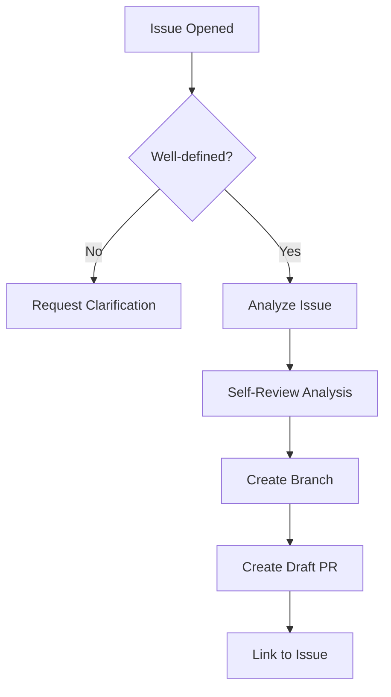

# Issue-to-PR Automation

**Convert well-defined issues to draft PRs automatically.**

---

## Overview

!!! note "Section Summary"
    When a well-defined issue is created, AI analyzes it and creates a draft PR. Reduces the 20-minute PR ceremony for 2-minute fixes. Human reviews the draft, not the initial work.

---

## Quick Start

!!! note "Section Summary"
    Copy the workflow YAML. Configure secrets (ANTHROPIC_API_KEY). Create a test issue. See the draft PR appear.

---

## How It Works

---

## Risk Categories

!!! note "Section Summary"
    Low risk (auto-fix eligible): formatting, linting, unused imports. Medium risk (PR only): refactoring, test additions. High risk (report only): breaking changes, security. How to configure each.

---

## Workflow YAML

!!! note "Section Summary"
    Complete workflow file with annotations. Trigger conditions. Permissions required. Environment variables.

---

## Safety Gates

!!! note "Section Summary"
    Draft PR only (requires human merge). AI analysis step with self-review. Clarification requests for unclear issues. How to add custom gates.

---

## Customization

!!! note "Section Summary"
    Custom labels for different risk levels. Custom analysis prompts. Integration with project boards. Slack notifications.

---

## Troubleshooting

!!! note "Section Summary"
    Common issues: workflow doesn't trigger, AI creates wrong PR, permissions errors. Solutions for each.

---

## Related Patterns

- [Self-Review Reflection](self-review-reflection.md) - AI reviews its own analysis
- [PR Auto-Review](pr-auto-review.md) - AI reviews the resulting PR
