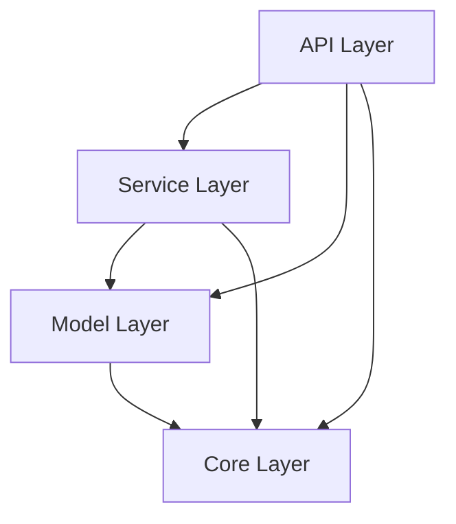

# Layered Architecture

**Code structure AI can reason about.**

---

## The Four Layers

```text
┌─────────────────────────────────┐
│      API Layer (FastAPI)        │  Routes, HTTP status codes
├─────────────────────────────────┤
│     Service Layer (Logic)       │  Business rules
├─────────────────────────────────┤
│    Model Layer (Pydantic)       │  Validation, serialization
├─────────────────────────────────┤
│   Core Layer (Utilities)        │  Config, security
└─────────────────────────────────┘
```

**Dependency rule**: Higher layers import lower, never reverse.

---

## Directory Structure

```text
app/
├── api/v1/items.py      # Routes
├── services/item_service.py  # Business logic
├── models/item.py       # Pydantic models
└── core/
    ├── config.py        # Settings
    └── security.py      # Utilities
```

---

## Layer Responsibilities

| Layer | Does | Doesn't |
|-------|------|---------|
| **API** | Routes, HTTP errors, OpenAPI docs | Business logic |
| **Service** | Business rules, CRUD, orchestration | HTTP concerns |
| **Model** | Validation, sanitization | Business logic |
| **Core** | Config, security utils | Domain logic |

---

## Example

```python
# API Layer - handles HTTP
@router.post("/items", status_code=201)
def create_item(data: ItemCreate):
    try:
        return item_service.create_item(data)
    except ValueError as e:
        raise HTTPException(status_code=409, detail=str(e))

# Service Layer - business logic
class ItemService:
    def create_item(self, data: ItemCreate) -> Item:
        if self._slug_exists(data.slug):
            raise ValueError("Duplicate slug")
        return Item(id=self._next_id, **data.model_dump())

# Model Layer - validation
class ItemCreate(BaseModel):
    name: str = Field(..., min_length=1, max_length=200)
    slug: str = Field(..., pattern=r"^[a-z0-9-]+$")
```

---

## Dependency Diagram



---

## Related Patterns

- [Security Patterns](security-patterns.md) - Where validation happens
- [Testing Patterns](testing-patterns.md) - How to test each layer
