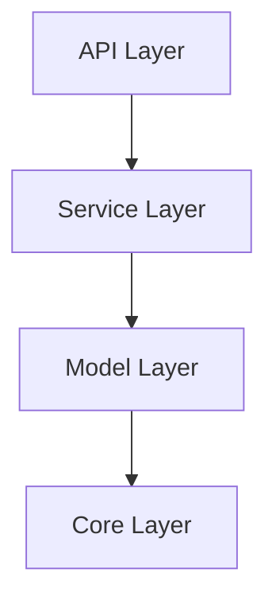

# Layered Architecture

**Code structure AI can reason about effectively.**

---

## Overview

!!! note "Section Summary"
    AI assistants struggle with spaghetti code. Clear layer boundaries help AI make better decisions. Four layers: API, Service, Model, Core. Dependency rule: higher depends on lower, never reverse.

---

## Quick Start

!!! note "Section Summary"
    Example directory structure. What goes in each layer. How to reference in CBA context files.

---

## The Four Layers

### API Layer

!!! note "Section Summary"
    Route handlers, request/response models, HTTP status codes, OpenAPI documentation. No business logic here.

### Service Layer

!!! note "Section Summary"
    Business logic, CRUD operations, orchestration. No HTTP concerns, no database queries directly.

### Model Layer

!!! note "Section Summary"
    Pydantic models, field validation, sanitization, serialization. Data structures and their rules.

### Core Layer

!!! note "Section Summary"
    Configuration, security utilities, logging, shared utilities. Cross-cutting concerns.

---

## Dependency Rule

!!! note "Section Summary"
    Why the rule matters. How to enforce it. What to do when you need to break it.

---

## AI Benefits

!!! note "Section Summary"
    Predictable AI outputs. Easier testing. Safer refactoring. How to describe layers in context files.

---

## Related Patterns

- [Security Patterns](security-patterns.md) - Where validation happens in layers
- [Testing Patterns](testing-patterns.md) - How to test each layer
