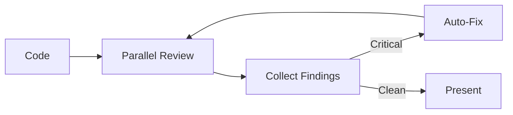
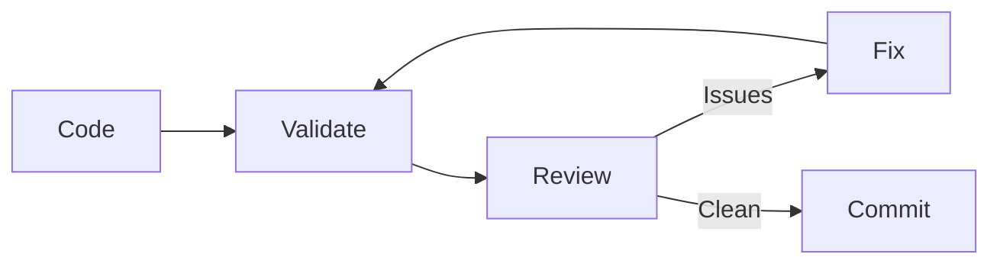

# Multi-Agent Code Review

**Pattern**: Launch parallel agent reviews before presenting code to users.

**Problem**: Single-perspective code review misses issues. Serial reviews are slow. Users receive code with obvious problems that could have been caught.

**Solution**: Launch multiple specialized agents in parallel. Each focuses on a different quality dimension. Collect findings, fix critical issues automatically, then present production-ready code.

---

## How It Works



### Key Characteristics

| Aspect | Description |
| ------ | ----------- |
| **Parallel execution** | All agents run simultaneously |
| **Specialized focus** | Each agent reviews one dimension |
| **Auto-fix loop** | Critical issues fixed before presentation |
| **Confidence scoring** | Only high-confidence issues flagged |

---

## Agent Specializations

### Architecture Advisor

Reviews structural decisions:

- Component boundaries and coupling
- Dependency direction (no circular deps)
- Pattern consistency across codebase
- API design and contracts

### Simplification Advisor

Reviews for unnecessary complexity:

- Over-abstraction (premature generalization)
- Dead code and unused exports
- Redundant logic and duplication
- Opportunities to simplify

### Security Advisor

Reviews security posture:

- Input validation at boundaries
- Authentication/authorization checks
- Secret handling (no hardcoded credentials)
- OWASP Top 10 vulnerabilities

---

## Implementation

### Reference Implementation

A reference orchestrator implementation would include:

- Parallel agent dispatch
- Finding collection and aggregation
- Critical issue auto-fix loop
- Report generation

**Note**: Adapt the agent invocation syntax to your specific tooling (Claude Code Task tool, OpenAI Assistants API, etc.). See the demo-fastapi repository for working examples.

### Agent Prompt Template

```markdown
You are the [SPECIALIZATION] Advisor.

Review the following code changes for [FOCUS AREA] issues.

## Rules
1. Only flag issues you're confident about (>80% certainty)
2. Provide specific file and line references
3. Categorize findings as CRITICAL, WARNING, or INFO
4. Include fix suggestions for CRITICAL issues

## Code to Review
[CODE_DIFF]

## Output Format
### CRITICAL
- [file:line] Description. Fix: suggestion

### WARNING
- [file:line] Description

### INFO
- [file:line] Observation
```

---

## Finding Categories

| Category | Action | Threshold |
| -------- | ------ | --------- |
| **CRITICAL** | Auto-fix before presenting | Block presentation |
| **WARNING** | Include in review notes | User decides |
| **INFO** | Optional mention | Low priority |

### Auto-Fix Rules

Only auto-fix when:

1. Issue is CRITICAL (blocks presentation)
2. Fix is mechanical (not judgment call)
3. Confidence is high (>90%)
4. Fix can be validated

Examples of auto-fixable:

- Missing input validation
- Unused import removal
- Hardcoded secret detection (replace with env var)

Examples requiring human judgment:

- Architecture refactoring
- API design changes
- Performance trade-offs

---

## Measuring Success

### Key Metrics

| Metric | Before | Target | How to Measure |
| ------ | ------ | ------ | -------------- |
| Critical issues in presented code | 2-3 | 0 | Agent review findings |
| Rework cycles per feature | 3-5 | 1 | Iteration count |
| Time spent on code review | Hours | Minutes | Review duration |

### Success Indicators

- User never sees code with critical issues
- First code presentation is production-ready
- Reviews complete in <10 minutes (parallel agents)

---

## Integration with AQE

Multi-agent review integrates with [Autonomous Quality Enforcement](autonomous-quality-enforcement.md):



**Sequence**:

1. Validation loop ensures code compiles and tests pass
2. Multi-agent review checks quality dimensions
3. Critical issues feed back into validation loop
4. Only fully validated and reviewed code reaches user

---

## Benefits

| Benefit | Description |
| ------- | ----------- |
| **Parallel speed** | 3 reviews in time of 1 |
| **Specialized depth** | Each agent focuses on one area |
| **Consistent standards** | Same review criteria every time |
| **Auto-remediation** | Critical issues fixed automatically |
| **Clean presentations** | Users see production-ready code |

---

## Related Patterns

- [Self-Review Reflection](self-review-reflection.md) - Agent self-reviews before presenting work
- [Autonomous Quality Enforcement](autonomous-quality-enforcement.md) - Validation loops and git hooks
