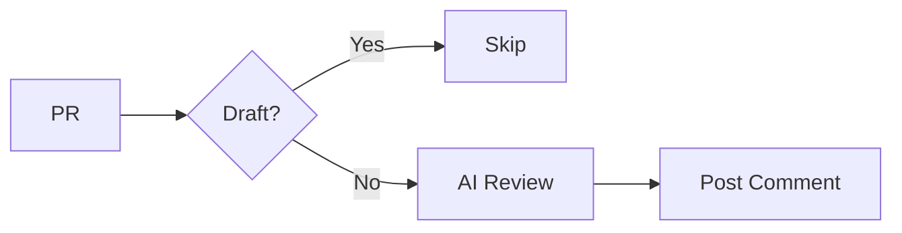

# PR Auto-Review

**AI-powered code review on every pull request.**

---

## Quick Start

Create `.github/workflows/pr-review.yml`:

```yaml
name: PR Auto-Review

on:
  pull_request:
    types: [opened, synchronize, ready_for_review]

permissions:
  contents: read
  pull-requests: write

jobs:
  review:
    if: github.event.pull_request.draft == false
    runs-on: ubuntu-latest
    steps:
      - uses: actions/checkout@v4

      - uses: anthropics/claude-code-action@v1
        with:
          anthropic_api_key: ${{ secrets.ANTHROPIC_API_KEY }}
          prompt: |
            Review PR #${{ github.event.pull_request.number }}.

            Focus on:
            - Security (injection, validation, secrets)
            - Bugs (edge cases, error handling)
            - Code quality (clarity, maintainability)

            Format findings as:
            🔴 CRITICAL: [must fix]
            🟡 WARNING: [should consider]
            ✅ GOOD: [positive observation]

            Be concise. Only flag high-confidence issues.
```

---

## How It Works



---

## Review Severity

| Level | Icon | Meaning |
|-------|------|---------|
| Critical | 🔴 | Security risk, crash, data loss - must fix |
| Warning | 🟡 | Bug risk, maintainability - should address |
| Info | ℹ️ | Suggestion - optional |
| Good | ✅ | Positive observation |

---

## Options

| Option | Add to workflow |
|--------|-----------------|
| **Inline comments** | `track_progress: true` in action inputs |
| **Skip Dependabot** | `if: github.actor != 'dependabot[bot]'` |
| **Skip by label** | `if: !contains(github.event.pull_request.labels.*.name, 'skip-review')` |
| **Block on critical** | Check output, `exit 1` if CRITICAL found |

---

## Troubleshooting

| Problem | Fix |
|---------|-----|
| Review not appearing | Check PR not draft, `pull-requests: write` permission set |
| Too noisy | Add "only flag high-confidence issues" to prompt |
| Misses issues | Increase `--max-turns`, add project-specific review criteria |

---

## Related Patterns

- [Issue-to-PR](issue-to-pr.md)
- [Multi-Agent Code Review](multi-agent-code-review.md)
