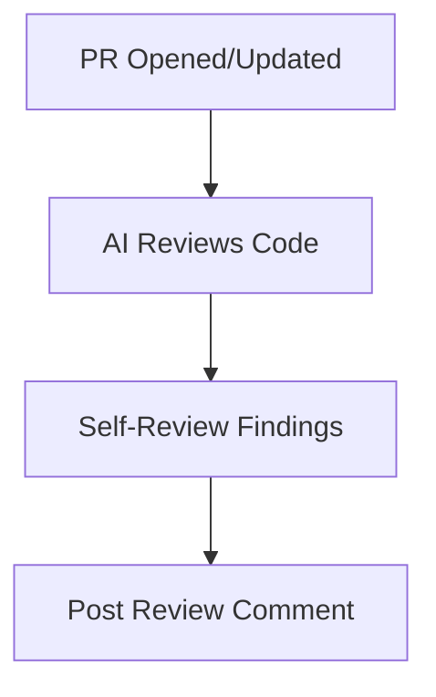

# PR Auto-Review

**AI-powered code review on every pull request.**

---

## Overview

!!! note "Section Summary"
    When any PR is opened or updated, AI reviews the code and posts structured feedback. Catches obvious issues before human time is spent. Severity levels: CRITICAL, WARNING, GOOD.

---

## Quick Start

!!! note "Section Summary"
    Copy the workflow YAML. Configure secrets. Open a test PR. See the AI review comment appear.

---

## How It Works

---

## Review Format

!!! note "Section Summary"
    Structured output format with emojis for quick scanning. CRITICAL (must fix), WARNING (should consider), GOOD (positive observations). Examples of each.

---

## Workflow YAML

!!! note "Section Summary"
    Complete workflow file. Trigger on opened and synchronize. Review prompt with focus areas. Comment posting.

---

## Customization

!!! note "Section Summary"
    Custom review criteria. Different prompts for different file types. Blocking vs commenting only. Integration with required reviews.

---

## Related Patterns

- [Issue-to-PR](issue-to-pr.md) - Source of PRs to review
- [Multi-Agent Code Review](multi-agent-code-review.md) - Multiple specialized reviewers
