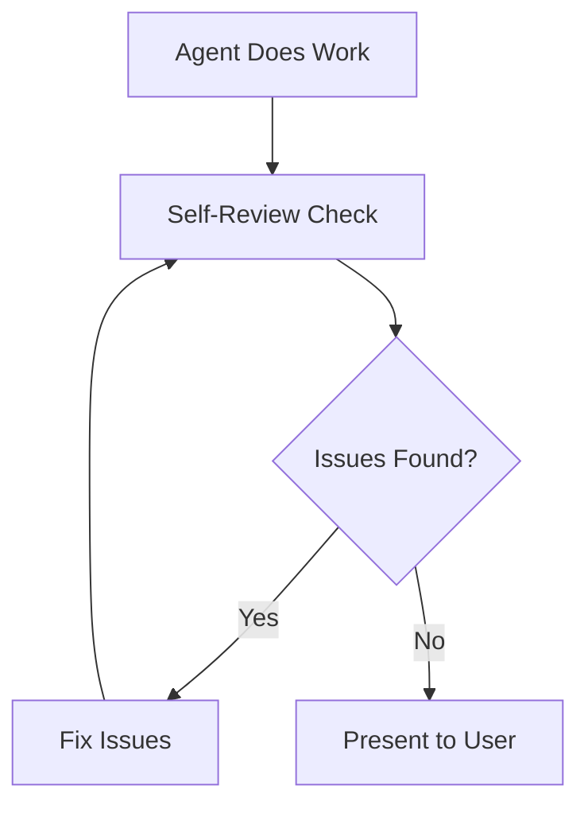

# Self-Review Reflection

**Pattern**: Agent reviews its own work before presenting to humans.

**Problem**: AI agents present work with obvious issues - missing edge cases, security gaps, incomplete reasoning. Users waste time catching problems the agent should have caught itself.

**Solution**: Build a reflection step into agent workflows. Before presenting any significant work, the agent re-examines its output from a reviewer's perspective, catches issues, and fixes them. Only polished work reaches humans.

---

## Quick Start (2 Minutes)

Add self-review to any agent prompt:

```markdown
## Self-Review Protocol

Before presenting your work:

1. Re-read your output as if you're a code reviewer
2. Check for:
   - Missing edge cases
   - Security issues (injection, validation, secrets)
   - Incomplete reasoning
   - Assumptions that should be stated
3. Fix any issues found
4. Only then present to user

If you found and fixed issues, briefly note: "Self-review: Fixed [issue]"
```

**Done.** Your agent now self-reviews before every response.

---

## How It Works



### The Reflection Loop

| Step | Action | Purpose |
|------|--------|---------|
| 1. Complete work | Agent finishes initial task | Get something to review |
| 2. Switch perspective | Agent becomes reviewer | Fresh eyes on own work |
| 3. Identify issues | Check against criteria | Catch obvious problems |
| 4. Fix and re-check | Iterate until clean | Polish before delivery |
| 5. Present | Show work to human | Only quality output seen |

### What to Check

**Code-related work:**

- Edge cases handled?
- Input validation present?
- Error handling complete?
- Security issues (OWASP Top 10)?
- Tests cover the changes?

**Analysis/planning work:**

- Reasoning complete?
- Assumptions stated?
- Alternatives considered?
- Risks identified?

---

## Implementation Examples

### In Agent System Prompts

```markdown
## Self-Review (Mandatory)

Before ANY response containing code, analysis, or recommendations:

1. Pause and re-read your work
2. Ask yourself:
   - "What would a senior engineer critique?"
   - "What edge case am I missing?"
   - "Is this actually correct?"
3. Fix issues before responding
4. Note significant fixes: "Self-review: [what you caught]"
```

### In GitHub Actions (Claude Code Action)

```yaml
- name: Analyze and self-review
  uses: anthropics/claude-code-action@v1
  with:
    anthropic_api_key: ${{ secrets.ANTHROPIC_API_KEY }}
    prompt: |
      Analyze issue #${{ github.event.issue.number }}.

      After your analysis:
      1. Write analysis to analysis.txt
      2. Re-read analysis.txt as a reviewer
      3. Check: Did I miss security concerns? Implementation risks?
      4. Update analysis.txt if needed
      5. Write "REVIEW_PASSED=true" to review-status.txt when satisfied
```

### In Multi-Step Workflows

```yaml
# Step 1: Do the work
- name: Generate implementation
  id: implement
  run: |
    # Agent generates code/analysis
    ./scripts/generate.sh

# Step 2: Self-review the work
- name: Self-review
  uses: anthropics/claude-code-action@v1
  with:
    prompt: |
      Review the implementation in ./output/.

      Check for:
      - Security vulnerabilities
      - Missing error handling
      - Edge cases
      - Code quality issues

      If issues found: fix them and re-validate.
      Write summary to ./output/self-review.txt
```

---

## When to Use

| Situation | Self-Review? | Why |
|-----------|--------------|-----|
| Code generation | ✅ Yes | Catches bugs before user sees them |
| Issue analysis | ✅ Yes | Ensures thorough reasoning |
| PR creation | ✅ Yes | Polishes before human review |
| Simple lookups | ❌ No | Overhead not worth it |
| Exploratory chat | ❌ No | Low stakes, fast iteration preferred |

**Rule of thumb**: Self-review when the output will be acted upon or when mistakes are costly.

---

## Measuring Success

| Metric | Before | After | How to Measure |
|--------|--------|-------|----------------|
| User-caught issues | 3-5 per task | 0-1 | Count feedback requiring fixes |
| Iteration cycles | 2-3 rounds | 1 round | Track back-and-forth |
| Time to approval | Variable | First try | Measure approval speed |

### Signs It's Working

- Users rarely say "you missed X"
- First submission is usually accepted
- Agent notes what it caught: "Self-review: added input validation"

### Signs It's Not Working

- Same issues keep slipping through
- Self-review always says "no issues" (not actually checking)
- Review step adds time but not quality

---

## Anti-Patterns

❌ **Rubber-stamp review**: "Self-review complete, no issues" without actually checking

❌ **Over-reviewing**: Spending 5 minutes reviewing a 2-line change

❌ **Review without criteria**: Vague "looks good" instead of specific checks

❌ **Skipping under pressure**: "No time for self-review" defeats the purpose

---

## Related Patterns

- [Autonomous Quality Enforcement](autonomous-quality-enforcement.md) - Validation loops for code quality
- [GHA Automation Patterns](gha-automation-patterns.md) - CI/CD workflows using reflection
