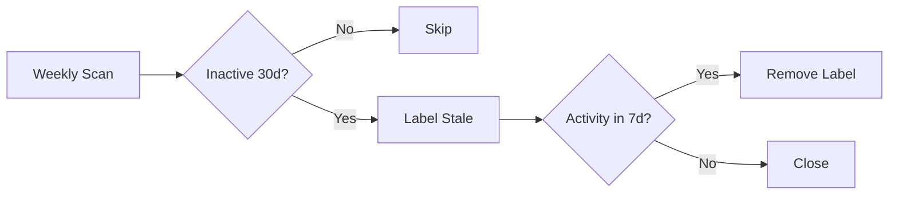

# Stale Issue Management

**Clean up inactive issues automatically.**

---

## Quick Start

Create `.github/workflows/stale.yml`:

```yaml
name: Close Stale Issues

on:
  schedule:
    - cron: '0 0 * * 0'  # Weekly
  workflow_dispatch:

permissions:
  issues: write
  pull-requests: write

jobs:
  stale:
    runs-on: ubuntu-latest
    steps:
      - uses: actions/stale@v9
        with:
          days-before-stale: 30
          days-before-close: 7
          stale-issue-label: 'stale'
          stale-issue-message: |
            Inactive for 30 days. Will close in 7 days unless there's activity.
          exempt-issue-labels: 'pinned,security,bug'
```

---

## How It Works



---

## Configuration

| Option | Default | Description |
|--------|---------|-------------|
| `days-before-stale` | 60 | Days inactive before marking stale |
| `days-before-close` | 7 | Days after stale before closing |
| `stale-issue-label` | Stale | Label to apply |
| `exempt-issue-labels` | - | Labels that prevent stale (comma-separated) |
| `days-before-pr-stale` | 60 | Set to -1 to disable for PRs |

---

## Exempt Labels

| Label | Purpose |
|-------|---------|
| `pinned` | Long-term tracking |
| `security` | Security issues |
| `bug` | Confirmed bugs |
| `help-wanted` | Seeking contributions |

---

## Troubleshooting

| Problem | Fix |
|---------|-----|
| Not running | Check cron syntax, workflow on default branch |
| Closing important issues | Add exempt labels |
| Too aggressive | Increase `days-before-stale` |

---

## Related Patterns

- [Dependabot Auto-Merge](dependabot-auto-merge.md)
