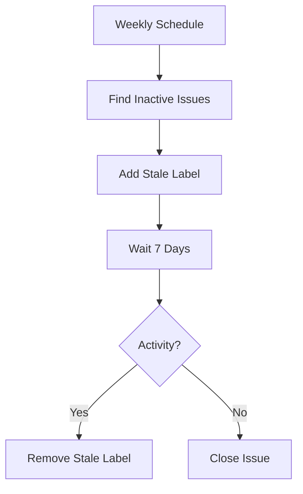

# Stale Issue Management

**Clean up inactive issues automatically.**

---

## Overview

!!! note "Section Summary"
    Issues inactive for 30+ days get labeled stale. After 7 more days of inactivity, they close automatically. Exempt labels protect important issues. Keeps backlog clean without manual triage.

---

## Quick Start

!!! note "Section Summary"
    Copy the workflow YAML. Configure exempt labels. Run manually to test. Watch stale issues get cleaned up.

---

## How It Works

---

## Configuration

!!! note "Section Summary"
    Inactivity threshold (default: 30 days). Warning period (default: 7 days). Stale label name. Warning message customization.

---

## Exempt Labels

!!! note "Section Summary"
    Which labels prevent closure: pinned, security, bug. How to add custom exempt labels. When to use exempt vs just commenting.

---

## Workflow YAML

!!! note "Section Summary"
    Complete workflow file using actions/stale. Schedule configuration. Issue and PR settings. Exempt labels.

---

## Customization

!!! note "Section Summary"
    Different thresholds for issues vs PRs. Custom messages. Integration with project boards. Metrics tracking.

---

## Related Patterns

- [Dependabot Auto-Merge](dependabot-auto-merge.md) - Another proactive cleanup pattern
