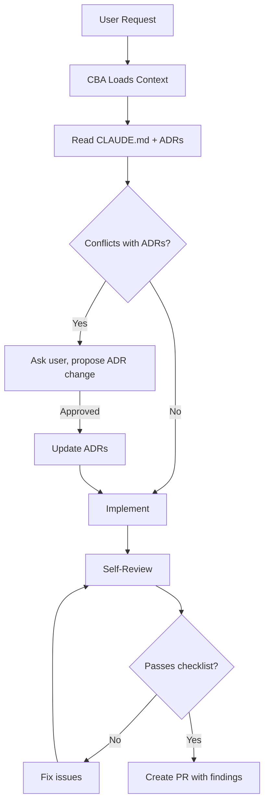

# Quickstart

Each pattern below is standalone. Pick one, follow its quickstart, done.

---

## Agent Behavior Patterns

How to configure AI agents for consistent, safe, high-quality assistance.

| Pattern | What It Does | Time |
|---------|--------------|------|
| [Codebase Agent (CBA)](patterns/codebase-agent.md) | Define AI behavior, capabilities, and guardrails | 30 min |
| [Self-Review Reflection](patterns/self-review-reflection.md) | Agent reviews own work before presenting | 5 min |
| [Autonomous Quality Enforcement](patterns/autonomous-quality-enforcement.md) | Agent runs linters/tests automatically | 15 min |
| [Multi-Agent Code Review](patterns/multi-agent-code-review.md) | Multiple specialized agents review in parallel | 1 hour |

**Start here if:** AI gives inconsistent answers, misses obvious bugs, or ignores conventions.

---

## GHA Automation Patterns

GitHub Actions workflows that handle routine work automatically.

| Pattern | Trigger | Time |
|---------|---------|------|
| [Issue-to-PR Automation](patterns/issue-to-pr.md) | Issue labeled `cba` | 30 min |
| [PR Auto-Review](patterns/pr-auto-review.md) | Pull request opened | 15 min |
| [Dependabot Auto-Merge](patterns/dependabot-auto-merge.md) | Dependabot PR (patch versions) | 10 min |
| [Stale Issue Management](patterns/stale-issues.md) | Weekly schedule | 10 min |

**Start here if:** PRs take forever, dependency updates pile up, or stale issues accumulate.

---

## Foundation Patterns

| Pattern | What It Does | Time |
|---------|--------------|------|
| [Security Patterns](patterns/security-patterns.md) | Input validation at boundaries, sanitization | 30 min |
| [Testing Patterns](patterns/testing-patterns.md) | Unit, integration, E2E test pyramid | 1 hour |

---

## The CBA Demo

The best way to understand CBA value is the **ADR before/after demo**.

### Scenario: User requests a change that conflicts with an existing ADR

**Without CBA (Vanilla AI):**

- Implements immediately
- Ignores project decisions
- Creates technical debt
- Future AI interactions still confused

**With CBA:**

1. Reads CLAUDE.md and ADRs
2. Identifies conflict with existing decision
3. Asks before proceeding
4. Proposes ADR change for approval
5. Updates all references (ADR index, CLAUDE.md)
6. Only then implements
7. Self-reviews before presenting



See [demo-fastapi](https://github.com/ambient-code/demo-fastapi) for this pattern in action.

---

## Reference Files

The `.claude/` directory contains example configurations:

```text
.claude/
├── agents/
│   └── codebase-agent.md    # Example CBA definition
└── context/
    ├── architecture.md      # Example architecture context
    ├── security-standards.md
    └── testing-patterns.md
```

Read these to understand the format. Create your own based on your project.

---

## Links

- **Working Demo**: [demo-fastapi](https://github.com/ambient-code/demo-fastapi)
- **Presentation**: [PRESENTATION-ambient-code-reference.md](https://github.com/ambient-code/reference/blob/main/PRESENTATION-ambient-code-reference.md)
